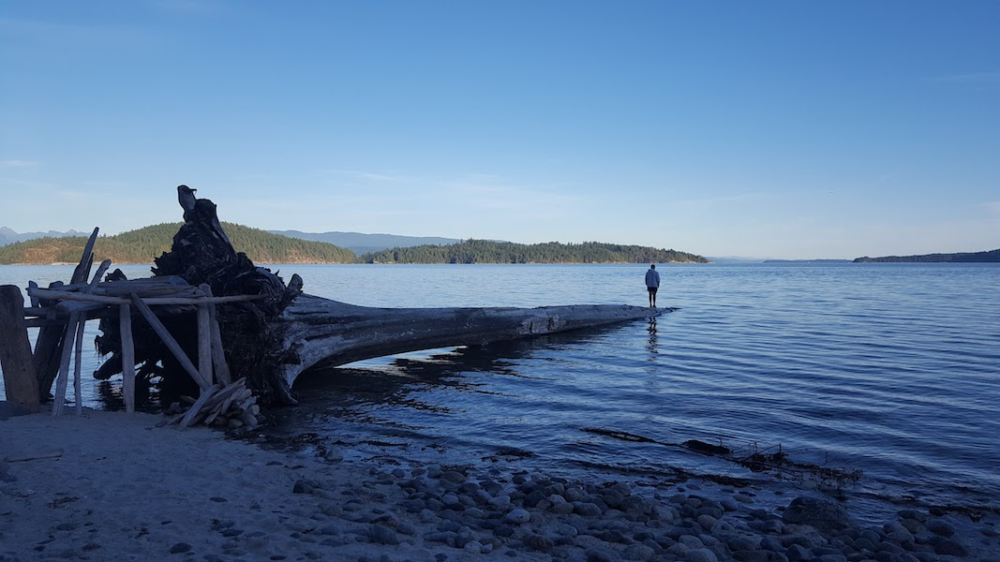
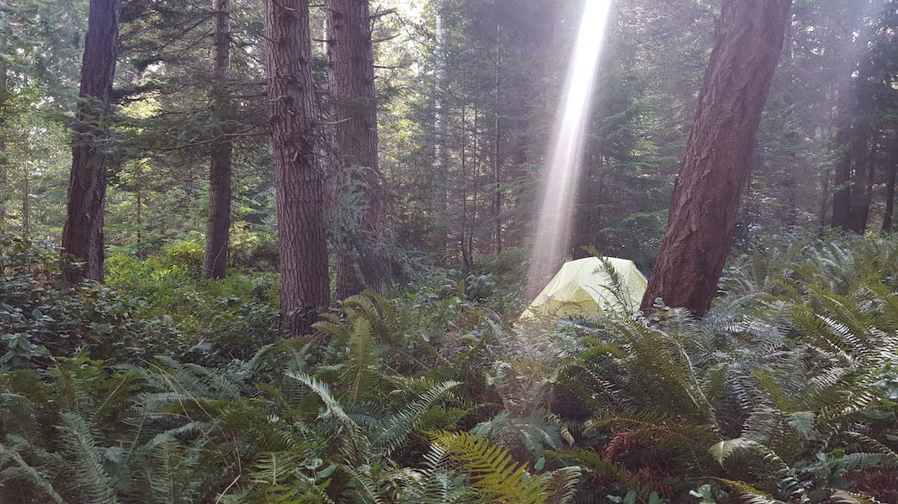
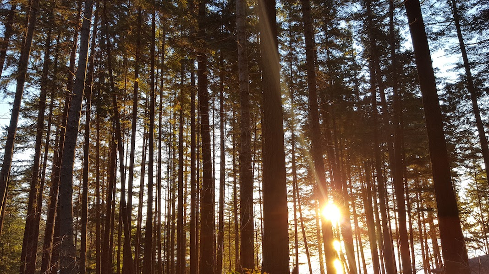
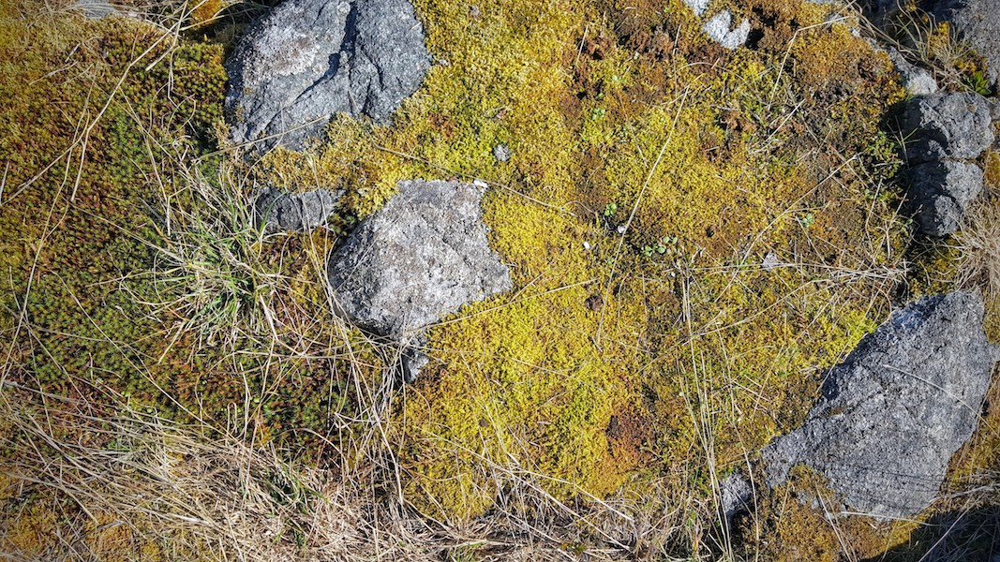

# Beyond Safe Spaces
## Part 1: Can We Grow Our Understanding of Inclusion & Diversity?
by [Richard D. Bartlett](http://richdecibels.com)

I’ve just spent 5 days at [Web of Change](https://www.webofchange.com/): a gathering of 80 progressive organisers and political technologists in Klahoose territory in British Columbia. They call it a conference, but I’d call it a retreat: a mini utopia set apart from our everyday reality. It was profound, complex, moving. I formed extraordinary bonds with people, connections that feel like wounds now we are apart.

The majority of participants were from the US and Canada, so as you can imagine, “inclusion and diversity” was a recurring theme. How do we gather without the men dominating women? How do we respond when White folks demand extra work from People of Colour? What do we do about the settler-colonists stealing space from Indigenous people?

In US & Canadian political spaces we put a huge amount of work into building “safer spaces”, which are designed to counteract any oppressive behaviours that seep into our organisations and gatherings. Sometimes it feels like this is exactly the work we should be doing: how can we struggle for a more equal society if we can’t even build a more equal organisation? 

But other times this work feels like it completely distracts us from the targets we should be focussed on. We are knee deep in a mass extinction event. The water, the land, the food, the fucking air we breathe is broken. The [8 richest men in the world](https://www.oxfam.org/en/pressroom/pressreleases/2017-01-16/just-8-men-own-same-wealth-half-world) have more wealth than the poorest 3.6 billion. Sometimes it is hard for me to see how our Safer Spaces and Conflict Resolutions and Community Agreements are making progress against these existential threats.

Now the retreat is over, I need to distract myself from yet another self-inflicted case of multilateral heartbreak. So I want to take some time to analyse how we include a diversity of cultures in our organising spaces. If we want to do a better job of including diversity, is it a question of *methodology* or *epistemology*: do we just need better methods, education, and tools, or do we need a fundamentally different understanding? I wonder if there are other approaches that are easier, more fun, more honest, more agile, more delightful than what I’ve encountered in North America? 

This is an enormous topic, with many threads of trauma woven in, so I’m going to put a little structure around my exploration. In the first part, I’ll introduce myself so you have a point of reference for my subjectivity. Then I’ll sketch out my understanding of “the US & Canadian progressive approach to inclusion and diversity” so we’re thinking about the same thing. I’ll offer an alternative way to consider interconnected oppression, from Black vegan feminist Aph Ko. In \<\<part two\>\> I’ll consider different parallel experiences: guests at a party, foreigners invited onto native land, and lovers opening up to each other. Maybe these analogies will give us some clues that we can take back to our organising. I don’t have many answers, but hopefully some of my questions *highlighted with italics* will trigger some new ideas.

Part one is context and theory, part two is a fun exploration. I won’t be offended if you skip ahead 😂

## Hi, I’m Rich

Let me put my bias up front: I’m a straight man, a member of the [settler-colonist](https://globalsocialtheory.org/concepts/settler-colonialism/) class in Aotearoa New Zealand. At home I identify as Pākehā, though in the rest of the world people recognise me as White. Being born into this body means society trained me to dominate women, demand extra work from the People of Colour, and steal space from Indigenous people. I’m undoing this training as fast as I can, but we’re not done yet.

I’m also right-handed, taller than average, and my body works basically the way I want it to. I co-founded [a software company](http://loomio.org), English is my first language, and my passport gives me easy access across most international borders. These are just some of the lenses that distort my vision. 

I realise that I’m only thinking *“what comes after safety?”* because I spend so much time feeling safe. I realise that is a rare privilege. I know it is controversial that I believe privilege is a resource to be collectivised rather than eradicated. 

## How we make safer spaces

Here’s a brief sketch of how I understand the prevailing approach to including a diversity of cultures in our political organising. This is common in many Western progressive spaces, but especially prominent in the US & Canada. This set of structures and behaviours is commonly referred to by the codename “safer spaces”.  We say “safe**r**” recognising this is an ongoing journey. Here are some of the ingredients:

* Before joining an organisation or attending a conference, participants are required to sign an explicit **agreement** about how they’ll behave in the space. This is variously known as a code of conduct, community agreement, etc. Here’s a [template example](http://confcodeofconduct.com/).
* There are some **sanctions** designed to correct oppressive behaviour, like a harassment policy and a conflict resolution process to make reparations for harm done, or to exclude people who have done harm. (Ideally the sanctions are [restorative](https://c4ss.org/content/50028) rather than punitive.)
* There’s usually a designated person or a **safety team** who provide support to folks experiencing oppressive behaviour. They also educate people about what the agreements mean, and enforce the sanctions.
* Gatherings will often be punctuated by **caucuses** for different identity groups. For example, there’ll be a space for just women, or a meeting of exclusively Indigenous people to have the kinds of conversations that can’t happen when the White men keep grabbing the mic.

These explicit structures are the tip of the iceberg: it’s easy to see the agreements and designated caucus spaces. There’s much more of the iceberg underwater: I’m always paying attention to the powerful social forces of belonging-and-exclusion submerged beneath the surface. I see a lot of these interactions as a complex **negotiation for how we’re going to be together**. Sometimes we are up front, making offers and requests: “I need…”. More often this happens subtly, with participants expressing their preferences by alternately shaming and praising people or behaviours.

In the 6 years I’ve been contributing to “safer spaces”, I’d say we’re collectively getting better at it. But still, it seems like the negotiation process is flawed, slow and painful. Our negotiations are guided by a tacit hierarchy: we’re trying to give priority to people who experience more oppression. 

One of the perverse outputs of this system is that people are implicitly encouraged to frame their needs in terms of trauma. See [this example from Clare Mohan](https://www.opendemocracy.net/transformation/clare-mohan/problem-with-safer-spaces): 

> “I have in the past found myself disagreeing with policies for safer space building, policies made by people who are open about their traumatic history. I am a rape survivor, but I prefer not to disclose this as a general matter, for the simple reason that it is private and I don't want this part of my history to be the first thing people know about me. But without acknowledging it, I have on various occasions been accused of 'speaking over' and oppressing those who are open about their history, meaning that I have to out myself, and render this trauma up for scrutiny.”

*I wonder if we could try a process where everyone names their needs before participating?* I have unique needs, not because of oppression or trauma, but because I’m a human. Capitalism and patriarchy keep trying to standardise me into a repeatable stackable box, but I don’t fit! I like my lumps.

At worst, the efforts to include diverse cultures can do real psychological harm to the participants. Many of us will recognise the awful tit-for-tat dynamic that can emerge: Person A misspeaks in a way that traumatises Person B, and then the group’s response results in Person A being publicly shamed. When Person A is a man and Person B is a woman, we call that a learning opportunity: *sorry your feelings got hurt but it’s a small price to pay for all that male privilege you carry around.* But what happens when Person A is Indigenous and Person B is Black? Yes, we may have all learned something, but both people are less likely to turn up to the next meeting. I don’t know how to recruit people into spaces like that.

The agreements+sanctions+caucus formula is designed to encourage more equitable participation from different people. We know it excludes some people too: most people simply don’t have the education to walk into a progressive space and express themselves without causing offence. Insofar as this barrier excludes patriarchal masculinity from dominating a conference, it’s a positive thing. When it excludes folks with less access to education, or less self esteem or social capital, that barrier is an “own goal” working exactly counter to its stated intent. *I wonder how we can evaluate if our processes are doing more harm than good?*

My instinct says that there is a better way, but first we need a different understanding. We can only get so far by tinkering with **methodology** — *I wonder if it is time to upgrade the **epistemology**?*

## A different way to understand oppression

In her essay “*Why Animal Liberation Requires an Epistemological Revolution*”, Black American vegan feminist Aph Ko says very plainly: **“…liberation can't happen until we change the way we understand oppression.”** She then lays out a challenging and intricate argument explaining how progressive and radical theories of interconnected oppression can reinforce a Eurocentric system. It’s well worth reading the essay in full (you can find it in *[Aphro-ism](https://aphro-ism.com)*, an extraordinary book recently published with her sister Syl Ko). Here’s what I took away from the essay:

The Eurocentric map says there are many different kinds of oppression. Sexism is different from racism, and the two *intersect*: we can’t ignore racism while we’re fighting sexism.  (That’s where [Intersectionality](https://en.wikipedia.org/wiki/Intersectionality) and [Third Wave Feminism](https://en.wikipedia.org/wiki/Third-wave_feminism) came from: people were exasperated with the Second Wave being mostly for White women.)

As educators, theorists and organisers raise our consciousness of different types of oppression, our maps get more and more complex. In many political spaces I’m expected to “educate myself” about an ever-growing list of issues. First I learned that patriarchy shuts women out of conversations. Then I learned settler-colonialism shuts out Indigenous people. Racism shuts out people who are not perceived White. Nationalism shuts out people with foreign grandparents. Ablism shuts out people who think or act differently to the prevailing “normal”. Capitalism shuts out people who earn a living from their labour rather than their property. Speciesism severely limits our concern for non-human animals. This list is going to keep getting larger. I’m going to keep discovering new ways that I unconsciously perpetuate oppression.

What blew me away about Aph Ko’s essay was the proposal that we replace that extraordinarily complex map with a much simpler one. Her map has two categories: **human** and **subhuman**. In the human category you have an “ideal person”: a male homo sapiens who is White, right-handed, cis-gender, Christian, wealthy, tall, slim, educated, etc. **Everyone else is subhuman.** 

> “In our mainstream animal rights movements, the dominant thought is: Animal oppression is its own oppression and it has nothing to do with race or gender (or any other marker of difference). … The idea that oppressions manifest separately and then randomly “connect” at different points is exactly the problem I'm having with the animal rights movement and most other mainstream social justice movements…

> “There's almost something tragic and comical about activists failing to realize the blatant missing piece to the activist puzzle: that your own oppression is anchored to your citizenship as a “subhuman” or “animal” in contemporary society. This is what makes racism, sexism, and all other “isms” possible. These “isms” are expressions of being labeled less-than-human. Therefore, this issue isn't just race-based or gender-based; it's simultaneously one of species as well… If we're not organising around this human–animal divide, then we aren't properly getting to the root of our oppression…

> “Within a Eurocentric analysis, activists have to spend all of their time “connecting” issues because everything is always and already singular and separate at the root. This should be our first sign that the theory we're using is designed around the experiences of the white elites, not our own.”

*How might we design for inclusion if we started with this alternative epistemology? How can our difference become a source of hybrid strength, rather than a constant source of tension and conflict? *

When I use the simplified human-subhuman map, I don’t have to fully understand sexism, racism, ableism, cisgenderism, nationalism, etc before I start to make progress on any of them. First I have to understand that *every body is different* and that *every body is equally deserving of dignity*. Then I have to understand that my epistemology, my way of making sense of the world, is infected with a virus. This virus erases the infinite difference of all those bodies as it summarises them into a manageable list of groups: women, Europeans, paraplegics, capitalists. 

When I remind myself that everyone is more different than I can imagine, I stop making so many assumptions. It feels natural to speak from “I”, and extremely risky to speak from “we”. I want to check with you before I include you in the we.

Using Ko’s human-subhuman framework, we don’t need to figure out which branch of structural oppression to hack down first, we can take them all down simultaneously by aiming for the root: **eliminate domination-submission relationships where they exist without consent**.  To understand the power balance in a given situation, I need to hold an awareness of the structural dynamics, while also paying close attention to the individual, peer-to-peer interactions. Structural oppression shapes the terrain, but each act of domination is perpetuated one person at a time. 

In one-to-one conversation, it’s not so difficult for two people to maintain a shared awareness of each other’s emotional state *(see also: [presence](https://medium.com/enspiral-tales/a-caring-organisation-5319f81c420f#ca28))*. We can continuously check in with each other, verbally and non-verbally, to keep the conversation within safe boundaries. Starting with “small talk” gives us a chance to sniff each other out: ‘does this person listen? are they interested? do I trust them? are they emotionally responsive? do they have hidden motives?’ If the signs are good, we can gradually move to more risky territory, sharing fears, dreams and trauma. 

Our *dreams* and our *traumas* are the raw material of social justice organising. Sharing them safely requires a very precisely constructed emotional space. I know how to co-construct that space in one-to-one conversation, and I’ve been there occasionally in [small high-trust groups](https://medium.com/enspiral-tales/5-reasons-to-build-a-network-of-small-groups-rather-than-a-mass-movement-of-individuals-46f2ea72b6b2). But I’ve never been in a large, high-diversity gathering where this exchange has gone well. Maybe this is because I’ve never been in a group without me in it. Maybe people have built this lovely fragile space and I’ve come in like a bull in a China shop. No matter how “woke” I get, I’m still a straight White guy in a cisheteropatriarchal White supremacist society. It could just be me, but if it’s not, *With these large gatherings, I wonder if we’re trying to walk before we know how to crawl? I wonder how we can each grow our capacity to do this emotional work? Can we have graduated spaces:* you must be this emotionally intelligent to join this meeting?

Geez, this stuff is hard eh! After 2500 words I was planning to have some neat and tidy answers by now 😅 In \<\<Part 2: Where Can We Take Our Togetherness?\>\>, I’m going to continue this exploration from some fresh directions. Maybe we can learn something about inclusion by way of analogies: hospitality, indigeneity, and eroticism.

*p.s. This story is licensed in the public domain, no rights reserved, i.e. do what you want with it. Html, pdf, and markdown formats [available](http://richdecibels.com/stories/beyond-safe-spaces).*
*p.p.s. These stories take days to write. I get a lot of encouragement when you hit that *👏🏽* button on Medium! If you want to free up more of my time for writing, you can [support me on Patreon](http://patreon.com/richdecibels)*.

---- 

# Beyond Safe Spaces
## Part 2: Where Can We Take Our Togetherness?
by [Richard D. Bartlett](http://richdecibels.com)

I want to learn how to do more effective political organising, so I’m exploring how social change happens in spaces that don’t look much like meetings. I’m thinking of the punks in the 70s, or the [hackathons I visited](https://blog.loomio.org/2015/04/13/g0v-summit-2014-taiwan-and-the-future-of-democracy/) in Taiwan as 1000s of young people successfully [rewrote the political logic](https://civichall.org/civicist/vtaiwan-democracy-frontier/) of their nation. Not a meeting in sight!

In Western progressive political spaces we talk about “safer spaces”, a formula for including a diversity of cultures in our organising. *I explore the context and theory of safer spaces in \<\<part one of this article.\>\>*

I’ve been dreaming lately, **what comes after safety?** I’m motivated by utopias, so I imagine: if we were all safe, where could we take our togetherness? Can we grow comfortable spaces, thriving spaces, therapeutic, energetic, sensual, creative, hospitable… even erotic spaces? 

While I’ve been contemplating this question, a few parallel experiences have come to mind: guests at a party, foreigners invited onto native land, and lovers opening up to each other. Maybe in considering these examples we’ll get some new ideas to bring back to our organising.

## Diversity and inclusion through hospitality

You can think of **hospitality** as one way to include different cultures in one space. When you’re in my house, I expect you to make an effort to conform to “how we do things around here”, and in return, I will make an effort to make you as comfortable as possible. I’m concerned with the needs of your distinctive, dignified human body: are you hungry, can I get you a drink? Does the lighting and music create a convivial atmosphere or is it getting in the way? My concern starts with the **physical experience of bodies in proximity**. I don’t want to discuss ideas until all the bodies in the room are feeling okay.

When we start on those terms, then I can very quickly get into a **relationship** with you. We don’t need to know a lot about each other; almost immediately I start to trust you. The more trust we share, the more intimate and vulnerable we can be together. Within these intimate spaces, I’m most able to change, to heal from trauma, to learn from different experiences, to let go of out-of-date ideas, to imagine a different world than the one I know.

I went to a lomilomi massage class and the instructor told me, “In Hawai’i, massage is just basic hospitality. When you come to my house, I offer food, drink, massage.” That’s the culture I want us to grow in our organising spaces: an abundance of touch, care and intimacy. Yes of course, boundaries, consent, safety comes first. And then: let’s be ambitious! 

Hospitality resolves a lot of social complexity by naming clear roles: *host* and *guest*. This is counter to the prevailing logic of many progressive organising spaces, where the focus is on “co-creation”, as if we can arrive with a blank slate and then all show up as equals to negotiate how we are going to be together. Hospitality operates on a fundamentally different logic. Instead of the blank slate and complex negotiation, we have just two factors: “how we do things around here” and “what you need to be comfortable”.

Ahhh, there’s the rub. “How we do things around here” presumes there’s a “we” who belongs “here”. So this is how we get to indigeneity. You see, my understanding of hospitality is not just about parties and shared meals, it’s also about how native people welcome others onto their land. 

## Diversity and inclusion through ceremony

Because I come from Aotearoa New Zealand, I know how it feels to be welcomed into indigenous territory. I understand the pōwhiri (*Māori welcome ceremony*) as [an intricate sequence of steps](https://teara.govt.nz/en/marae-protocol-te-kawa-o-te-marae/page-2) for manuhiri (*guests*) to meet with tangata whenua (*people of the land*) and make peaceful, mutually beneficial exchange. Whatever your background, when you’re on the local marae (*meeting grounds*), you adopt local tikanga (*the correct way of doing things, locally defined*). Te Ao Māori (*the Māori world*) I know is not closed: it is open to trade, so long as we prioritise right relationships. 

Colonisation is still hugely damaging to Māori, don’t let me understate that: I’m just saying that I’ve seen Māori techniques for negotiating between cultures that seem to be safe *and* productive. **And it feels good.**

So there’s one path for folks looking for a more straightforward way to include diverse cultures in your organising: **submit yourself to Indigenous leadership** and follow the protocols of your host. *(I profoundly regret [touring political spaces all across the US](https://medium.com/enspiral-tales/4-things-that-struck-me-after-visiting-political-spaces-in-14-us-cities-c1dceb1e8cb4) without visiting any Indigenous spaces — next time I’ll do different.)*

For many organisers, that’s not a realistic option, at least not in the short term. So I wonder if there are other lessons to learn from this “inclusion through ceremony” lens? I think of the Māori welcoming process as a sophisticated technology to bring groups together in preparation for some exchange. Even in informal settings, you *always* meet Māori people over food. By comparison, our European methods feel rudimentary, ill-equipped for bringing difference together safely.

Reflecting on my experience at Web of Change, all of my best learning moments came immediately after the exchange of gifts. Someone offered me a coffee, then they helped me see how my cisgender bias was confusing my understanding of patriarchy. I prefer this quiet, gentle exchange far more than having my ignorance announced in public, where someone reminds everyone that I’m *“just another typical White male saviour!”*

Another time: I offered someone a smoke, we settled in and relaxed, and then I learned about the mostly unrecognised surge of First Nations organising in [Turtle Island](https://en.wikipedia.org/wiki/Turtle_Island_(North_America)). Again, it was a gentle exchange of stories, a bonding experience. Easy. Compare this to other experiences I observed, where people’s ignorant questions triggered a facilitation crisis. There is so much trauma associated with First Nations activism in Canada, because the enormous damage of colonisation has not even stopped, let alone healed. So just asking questions can bring up a lot of pain. This is the point: **bringing different people together can be extremely painful, we need more than just good intentions to make these meetings safe and productive.**

*I wonder if we can design our events to put the exchange of gifts before the exchange of ideas? Can we trade stories before we make theories out of them? Can we design our eating and drinking to be the central activity, rather than marginal “fuelling up” time? Maybe we can start our gatherings with many small connections: peer-to-peer spaces where intimacy can grow quietly, rather than pouring everyone into one big noisy group?* 

I want to make one more analogy, another way to think about diversity and inclusion: I’m thinking about love and sex.

## Lovers opening to each other, knowing the risks. 

I started writing this article in Vancouver Airport and finished it in Buenos Aires. My first night here, I had an epic dream, one of those dreams that feels like switching into a vastly more creative intelligence than the one I carry in my waking mind. All at once, I saw an unbroken chain of lovers all the way from Argentina to Canada, a network ten thousand miles long, weaving profound tenderness and intimacy. And between each of these lovers, there it was, that fragile careful space where our stories transform from trauma to healing to bonding to courage to joy to peace. 

I’ve spent so much time wondering [how on earth there can be enough healing](https://medium.com/enspiral-tales/4-things-that-struck-me-after-visiting-political-spaces-in-14-us-cities-c1dceb1e8cb4) for all the people wounded by all the awful injustice in the world? I woke up from this dream feeling/knowing *there’s more than enough, there’s more than enough*. Maybe I’ve shown up to meetings looking for a kind of therapy that I could find in the arms of a lover.

We could hurt each other. You can say all the right words, but I’ve heard the right words before. You can approach me with respect and consideration, you can charm me with flirting and flattery, I can be intoxicated with desire, and still a part of me knows that you could hurt me. If I let you in here, you could hurt me. So most of the time, I decide to stay closed. Maybe I’ll open the front rooms, invite you into the foyer, but I’ll keep the valuables locked up further inside.

But sometimes, sometimes I open all the doors, let the light and the air in: occasionally I’ll give you an all-access pass. And wow! when you and I meet there, we learn so much, feel so much, play so much!

Allowing someone into my space is risky. But the pay-off is so good, I’m going to keep doing it regardless of how many times it goes badly.

How does eroticism fit into our organising? A lot of people want more love and more sex. When we gather for conferences and retreats, there’s usually a hidden undercurrent of people hooking up with each other. *What might we learn if we designed our events intentionally for people to find new lovers? What structures would we need to make that good for everyone?*

This is what I mean, beyond “safe”, even beyond “satisfied”, I want to take our togetherness all the way out to “delighted”, and further still to places I’ve not been yet.

## So what?

I want to hear what comes up for you when you read this article. Do you feel like you basically understand intersectionality and we just need new methods to embody it? Or are you operating on a different understanding of oppression and liberation than what I’ve described here? Do you have great experiences of trans-cultural negotiation you want to share?

I can anticipate a certain number of White men taking this as an invitation to complain about being prevented from dominating organisations or gatherings. If that’s you, please read [this article I wrote for you](https://medium.com/@richdecibels/dear-white-guy-with-dissenting-views-about-racism-and-sexism-3a783188d1ac) before commenting on this one. 

Everyone else: please point me to your stories, your resources, your insights and intuitions. I’d love to exchange with you. 

❤️💜💙🐸💛

*p.s. This story is licensed in the public domain, no rights reserved, i.e. do what you want with it. Html, pdf, and markdown formats [available](http://richdecibels.com/stories/beyond-safe-spaces).*
*p.p.s. These stories take days to write. I get a lot of encouragement when you hit that *👏🏽* button on Medium! If you want to free up more of my time for writing, you can [support me on Patreon](http://patreon.com/richdecibels)*.