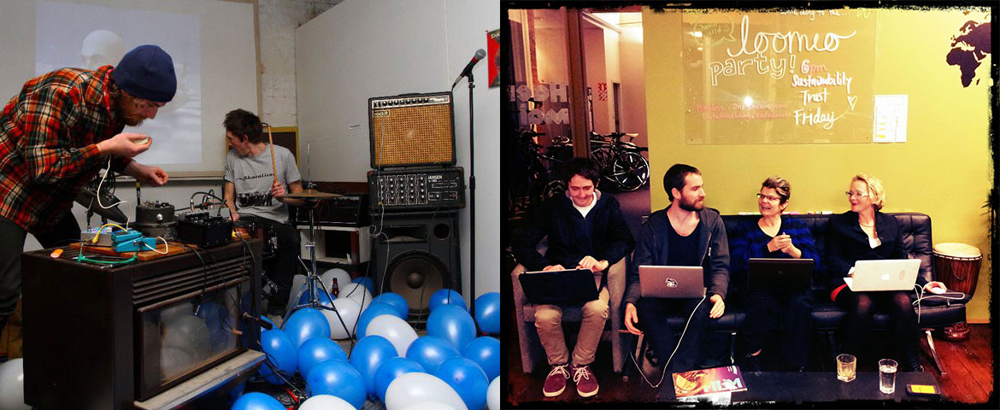

# Improvised Collaboration is Effortless in Music — Can We Do the Same at Work?
## A story about *playing* not *working*, and a collaborative writing technique for you to try.

I used to play music with my friend Ben a couple times a week. He’d supply the rhythm, I’d bring melodies. We used electronic devices to make inexplicable combinations — a couple of recognisable instruments in a mess of wires and duct tape, sensors transforming snare hits into bass lines, modified microphones leaving sparse sonic residue from our eviscerated voices. He’s a neuroscientist, I’m an inventor. Together we were *The Nervous System*, pouring out sensory stimulation as an invitation for you to make your own meaning, like a hundred pretty landscapes painted on top of one canvas. I mean we played weird music you can dance to:

[https://thenervoussystem.bandcamp.com/track/third-movement-session-i](https://thenervoussystem.bandcamp.com/track/third-movement-session-i)

I’m an amateur musician in a town full of amateur musicians, so I’ve played with a couple dozen people. It’s like dating. Sometimes after the first date you can tell there’s not going to be any chemistry. Other times you find a connection that’s so strong it’s almost embarrassing, like, *are we really sharing these fantasies with each other already?*

In my early 20s I lived with Scott, a guitarist who took me under his wing and taught me a lot. Like: a really good guitar solo requires you to lose your composure, you need to push your expression out beyond your technical ability, you need to risk destroying the whole song. 

One day we invited 6 or 7 people to our house for a jam. We improvised together for a few hours. Mostly I remember clouds of smoke and walls of noise, and one brilliant moment where all of us collectively landed on an unexpected, precise, perfectly coordinated crescendo. Unexpected because there was no one doing the coordinating.

Music gives us structure for effortless collaboration. Tools, shared context, precise notation, folk tradition. I could say “12 bar blues in E” to any one of hundreds of millions of people in the world, and make great art together, with no other conversation or explicit coordination beyond those five short syllables. *I can hear that you’re covering the bass, so I’ll come up and fill out the treble. You’re ready to go exploring so I’ll hold down the rhythm. We take turns without thinking about it. Oops I stumbled, dropped the beat, but no, you recovered it, optimistically interpreting my accident as an invitation to explore a new direction together.*

The experience of music emanates from our physical bodies: my heartbeat a kick drum, my voice box a sophisticated wind instrument, my brain merging your sounds into my sounds making chords I can’t construct on my own. The structure of music, the keys, genres, and notation make an abstract objective map of that subjective physical experience. The culture of music passes those maps around for other musicians to read, to follow precisely, or just to be inspired by: *oh I see where you’ve been, I wonder if there’s another path nearby?*

So as I spend less time with musicians, and more time with working teams and collectives, I’m preoccupied with the idea that all of our collaboration could be as effortless and joyful as this. We make new songs by *playing* together. So why does planning an event or building a website usually feel like *working*?

This preoccupation is a longterm research project, I’m not expecting quick results. In the 7 or 8 years I’ve been meditating on it, so far I’ve uncovered only one concrete example of collaborative *play* replacing *work*: writing together.

Remember Ben from the start of this story? A few months after we’d been playing music together for a few months, we started organising events with a new political arts collective. We hosted exhibitions, film screenings, and talks, building community around shared values and shared meaning. The events always had some politically-charged content, like *how do we respond to the US War on Terror arriving in Aotearoa New Zealand?* and *how can NZ citizens support Palestinian statehood?* 

The traditional news media have a way of ignoring or ridiculing events like this, so Ben and I set out to write press releases that had a better chance of getting published. Neither of us had any experience in PR or marketing, but we’d read enough newspapers to imitate the style. This is where we started prototyping a collaborative writing method that proved astonishingly effective for years. The [first press release](http://www.scoop.co.nz/stories/CU1105/S00470/concerned-citizens-exhibition.htm) we ever wrote got published in the [back pages](http://www.stuff.co.nz/dominion-post/news/5088434/Urewera-18-focus-of-exhibition) of one of the main national newspapers. The [next one](http://www.scoop.co.nz/stories/PO1106/S00038/concerned-artists-to-catapult-bus-outside-beehive.htm) made it to [page 2](http://www.stuff.co.nz/dominion-post/news/5097412/Protest-highlights-terror-raid-case), with a attention-grabbing photo and a big headline. If you think about it, it’s a remarkable achievement for a couple of DIY punks to successfully use Murdoch-owned media to generate positive coverage for anti-imperialist activism. I put it all down to the **collaborative writing method**.

Here’s how we do it:

The two of us sit in the same room, each with our own computer, opened to the same collaborative document. (We used Google Docs but any collaborative text editor would do, like [Etherpad](http://etherpad.org/) or [HackMD](hackmd.io)).

I’d ask Ben “so what do we need to communicate?” and he would answer out loud. Most people find it easier to speak ideas rather than write them. So while Ben spoke, I’d note down the key bullet points: *the event is being hosted in this time and place, for that reason, by those people.*

Looking at the list of bullet points, I’d respond conversationally, trying out ways of expressing each point. As I speak, Ben is typing, turning those bullet points into sentences. The sentences come out pretty good first time, because I’m just speaking to my friend, which is so much easier than writing for an imagined audience.

Now the magic happens: the two of us have both contributed to the formation of each sentence, so neither of us feels overly attached to any of them. Because our egos are out of the way, it’s effortless to re-order the sentences into paragraphs, deleting parts, throwing in new ideas to try, throwing them out if they don’t fit. When there’s a flood of inspiration, we’d add more bullet points to the list, then come back around and polish them out into sentences and paragraphs later. When the writing slows down, one of us starts speaking again, feeding off each other’s energy. (*Hey what if we got the prime minister and her nemesis to both contribute to this exhibition? [Good idea buddy](http://www.scoop.co.nz/stories/CU1108/S00450/helen-clark-and-tame-iti-in-support-of-palestinian-statehood.htm)!*)

A few months later we started the tech co-op [Loomio](loomio.org) together. We used the same collaborative writing method to write articles, presentations, business plans, video scripts, and uninspiring but important emails that are so hard for me to write on my own.

The method is many times faster than writing on my own, and the output is much stronger. The style is conversational, which feels nice to read. The ideas have all been passed through at least two brains, so the confusing and awkward bits get polished out. Most importantly for me, getting my ego out of the question makes for much more rapid iteration: write a bit, try it out, improve or reject, write some more… Having two people together turned the *work* into something much more like *play*.

So now I can play this one collaborative work song I’m wondering: what else could we play? And what tunes do you know?

*p.s. This story is licensed in the public domain, no rights reserved, i.e. do what you want with it. Html and markdown formats [available for reproduction](http://richdecibels.com/stories/collaborative-writing/).*
*p.p.s If you want to free up more of my time for writing, you can [support me on Patreon](http://patreon.com/richdecibels)*.