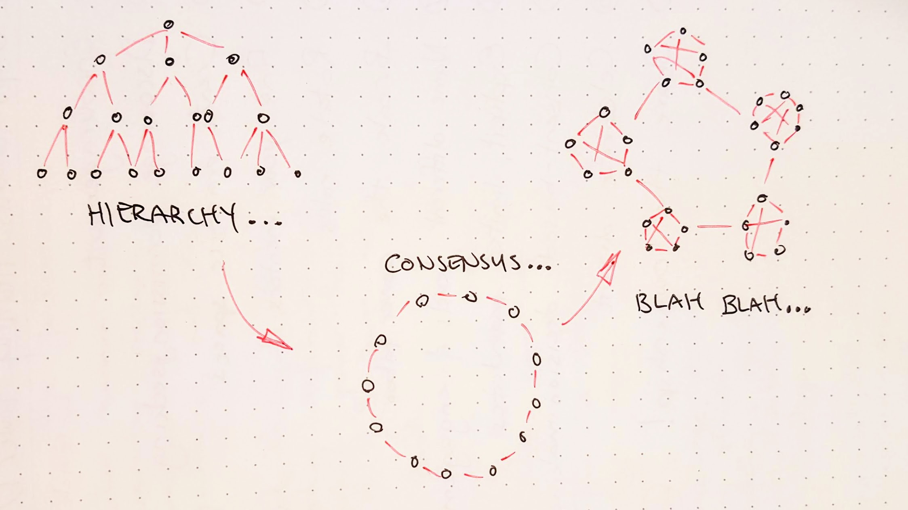
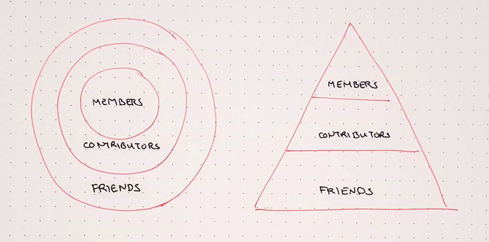
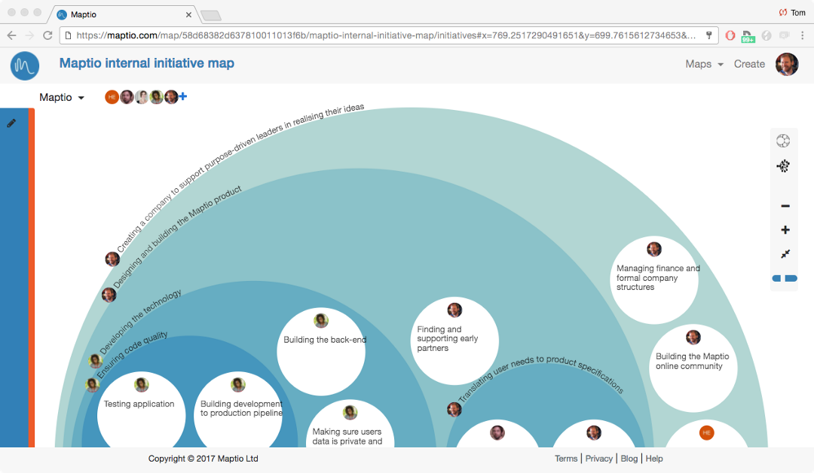

# Hierarchy Is Not the Problem…
## ...It’s the Power Dynamics

We hosted a workshop on decentralised organising for the [Civicwise](http://civicwise.org) network in Modena last week. 

At one point I said, “**I don’t care about hierarchy, hierarchy is not the problem**,” and immediately felt the temperature in the room drop by a few degrees. 

I know I can be provocative with my overly-concise use of language, so I wanted to take some space here to explain more thoroughly. It will take me a few minutes to describe my understanding of hierarchy and power, making the argument that this focus on “hierarchy” is a dangerous misdirection. Then in part 2??, I share 11 practical steps that you can take to improve the power dynamics at your workplace, whether you’re in a horizontal collective, decentralised company, hierarchical organisation, or a post-consensus social foam. 
---- 
## Hierarchy Is Just a Shape

For this argument, we need to set aside our emotional and political reactions to the word “hierarchy”. Let’s pretend for a few minutes that we’ve never seen the horrible coercive inefficient hierarchies of human organisations, and just treat the word as a neutral scientific term. I’m thinking of hierarchy purely as a _taxonomy_, a way to map a system into nested relationships.

Take **language** for instance. If you tell me you hate _fruit_, I know not to offer you an _apple_. It would be impossible to make sense of the world without these hierarchical relationships.

Many natural systems can be understood through a hierarchical metaphor: a tree has a trunk and branches and twigs and leaves. I have no issue with that hierarchy. I don’t think we need a revolution for leaves to overthrow their branches.

In this taxonomical view, hierarchy is an amoral metaphor, a map, a shape which allows me to efficiently explain that **_this_ is contained by _that_**.

I don’t think it is inherently unjust to have an organisation with some hierarchical forms. You might have a communications department, alongside an engineering department, and they may both be contained by some coordinating function.

In the kind of “self-managing” “flat” “non-hierarchical” or “less-hierarchical” organisations we work with at [The Hum](http://thehum.org), org charts are usually drawn with **friendly circles** instead of **evil triangles**. 

Take Enspiral, for instance. We frequently use a circular metaphor to draw a map of our the different roles in the network. I know the circle has symbolic importance for us, but… isn’t it just a pyramid viewed from a different angle?

---- 

## So What?
More than just an abstract semantic debate for word nerds, I believe that this fascination with “hierarchy” and “non-hierarchy” is a major problem. **Focussing on “hierarchy” doesn’t just miss the point, it creates cover for extremely toxic behaviour. **

I have encountered _so many_ organisations who describe themselves as “non-hierarchical”, and wear that label as a badge of pride. 

I’m guilty of this myself: having declared ourselves to be a “non-hierarchical” organisation, I’m unable to clearly see the un-just, un-accountable, un-inclusive, un-transparent, un-healthy dynamics that inevitably emerge in any human group. Calling ourselves “non-hierarchical” is like a free pass that gets in the way of our self-awareness.

Jo Freeman named this beautifully in  _[The Tyranny of Structurelessness](https://www.jofreeman.com/joreen/tyranny.htm)_, where she argues that the informal hierarchies of a “structureless” group will always be less accountable and fair than a more formal organisation. It’s worth reading the essay in full, but I’ll pull out a couple paragraphs here to give you the flavour: 

> “Contrary to what we would like to believe, there is no such thing as a structureless group. Any group of people of whatever nature that comes together for any length of time for any purpose will inevitably structure itself in some fashion. The structure may be flexible; it may vary over time; it may evenly or unevenly distribute tasks, power and resources over the members of the group. But it will be formed regardless of the abilities, personalities, or intentions of the people involved. (…)
> “This means that to strive for a structureless group is as useful, and as deceptive, as to aim at an "objective" news story, "value-free" social science, or a "free" economy. A "laissez faire" group is about as realistic as a "laissez faire" society; the idea becomes a smokescreen for the strong or the lucky to establish unquestioned hegemony over others. This hegemony can be so easily established because the idea of "structurelessness" does not prevent the formation of informal structures, only formal ones. Similarly "laissez faire" philosophy did not prevent the economically powerful from establishing control over wages, prices, and distribution of goods; it only prevented the government from doing so. Thus structurelessness becomes a way of masking power, (…) usually most strongly advocated by those who are the most powerful (whether they are conscious of their power or not). As long as the structure of the group is informal, the rules of how decisions are made are known only to a few and awareness of power is limited to those who know the rules. Those who do not know the rules and are not chosen for initiation must remain in confusion, or suffer from paranoid delusions that something is happening of which they are not quite aware.

Freeman uses the word “structureless”, which is specific to the context of her 1960’s feminism. Today, you could swap “structureless” for “non-hierarchical”  and get a very accurate diagnosis of a sickness that afflicts nearly every group that rejects hierarchical structures.

We’re coming up to the 50th anniversary of this essay, and still it seems the majority of radical organisations have missed the point.

So I repeat: **I don’t care about hierarchy.** It’s just a shape. **I care about power dynamics.**

Yes, when a hierarchical shape is applied to a human group, it tends to encourage coercive power dynamics. Usually the people at the top are given more importance than the rest. But the problem is the _power_, not the shape. So let’s focus on the problem.

---- 

## More Feminists Talking About “Power”

“Power” is a complex, loaded word, so let’s slow down again and unpack it.

My understanding borrows a lot from Miki Kashtan and Starhawk, who in turn borrow from [Mary Parker Follett](https://www.thoughtco.com/mary-parker-follett-biography-3528601). _(To follow this train of thought, read Kashtan’s [Myths of Power-With](http://thefearlessheart.org/myths-of-power-with-1-everyone-can-be-included/) series and Starhawk’s excellent short book [The Empowerment Manual](https://starhawk.org/writing/books/the-empowerment-manual/).) _

Follett coined the terms “power-over” and “power-with” in 1924. Starhawk adds a third category “power-from-within”. These labels provide three useful lenses for analysing the power dynamics of an organisation. With apologies to the original authors, here’s my definitions:

* **power-from-within** or **empowerment** — the creative force you feel when you’re making art, or speaking up for something you believe in
* **power-with** or **social power** — influence, status, rank, or reputation that determines how much you are listened to in a group
* **power-over** or **coercion** — power used by one person to control another

I think words like “non-hierarchical”, “self-managing” and “horizontal” are kind of vague codes, pointing to our intention to create healthy power relations. In the past, when I said “Enspiral is a non-hierarchical organisation”, what I really meant was “Enspiral is a non-coercive organisation”. That’s the important piece, we’re trying to work without coercion. 

These days I have mostly removed “non-hierarchical” from my vocabulary. I still haven’t found a great replacement, but for now I say “decentralised”. But again, it’s not the shape that’s interesting, it’s the power dynamics. 

Here are the power dynamics I’m striving for in a “decentralised organisation”:

1. **Maximise _power-from-within_**: everyone feels empowered; they are confident to speak up, knowing their voice matters; good ideas can come from anywhere; people play to their strengths; creativity is celebrated; growth is encouraged; anyone can lead some of the time.
2. **Make _power-with_ transparent**:  we’re honest about who has influence; pathways to social power are clearly signposted; influential roles are distributed and rotated; the formal org chart maps closely to the informal influence network.
3. **Minimise _power-over_**: one person cannot force another to do something; we are sensitive to coercion; any restrictions on behaviour are developed with a collective mandate.

This sounds nice in theory, but how does it work in practice? I’ve been experimenting with these questions for years as a cofounder and a coach, so I have some practical suggestions for shifting power in each of the three dimensions.

---- 

# 11 Practical Steps Towards Healthy Power Dynamics at Work

I’m primarily writing this for people that strive towards “non-hierarchical” organising, but expect the lessons will translate into any organisational context.

---- 

## Empowerment: How to Maximise _Power-From-Within_
Everyone is born with great potential, but sometimes it takes a bit of **encouragement** before we fully embrace it.

Because of the intersecting injustices of modern societies, the degree of encouragement you receive when you’re growing up will vary greatly depending on many factors like your personality, gender, physical traits, and cultural background. If you want everyone in your org to have full access to their power-from-within, you need to account for these differences.

### Step 1. Encourage your peers
This is very simple, but it can still have a great impact. Notice what happens when you spend more time saying “good job”, “you can do it”, “I believe in you”, “I’ve got your back”, or “I’m with you”. 

### Step 2. Discourage permission-seeking
Notice when someone is asking for your approval before they act. Is it absolutely necessary? If not, try responding with “_what do you think?_” or “_let’s figure it out together_” or “_why do you ask?_” or “_you know what to do_.”

### Step 3. Create practice spaces
If you’re not used to exercising your creative power, it can take **practice**. Even a small thing like a regular ‘check-in’ round, where all meeting participants are expected to say a few words before the work begins, can be a significant training ground for people to practice owning their voice and holding the attention of a group.

### Step 4. Find you mentors
Great **mentorship** makes an enormous difference. A mentor is someone _you can identify with_, who has more experience or maturity or growth in some area that you care about. You can imagine parts of their life story as your own. Great organisations support people to find mentors that are truly inspiring.

### Step 5. Rotate roles
**Rotate roles** to give more people the experience of being in an empowered position. Take turns to facilitate meetings, have co-presenters on stage, support coordinators with a peer or understudy.

Okay, that’s the easy level. If your group power dynamics feel out of balance, you can always return here to keep practicing these fundamentals. Now it’s time to get into some more difficult territory.

---- 

## Social Power: How to Make _Power-With_ Transparent

“Power-with” is that social power that determines how much you are listened to in a group. It can operate in the shadows, and lead to manipulation and paranoia. Or you can throw a light on, and use this influence network to support good governance and effective decision-making.

### Step 6. Break the power taboo

When we work with teams who want to improve their power dynamics, the first thing we need to do is **break the power taboo**.  

In most spaces, it is uncomfortable, exposing or counter-cultural to talk about power. It’s not just awkward, it can be a deeply unsafe, psychologically triggering conversation. It takes a lot of preparation and care to create a safe and productive container for a group to talk about their power dynamics. 

But once we break the taboo, we can start to distinguish between the different kinds of power. We notice that some power imbalances are toxic (e.g. bullying), while others are healthy (e.g. eldership).

Surprisingly, when Nati and I host conversations about internal power dynamics in a team, the insight we hear most frequently is a sense of empathy for the people who are holding the _most_ power. We hear how difficult it can be for the people holding the most influence, responsibility and care for the project, especially when their mandate is unclear and their support is insufficient. 

### Step 7. Name the different levels of engagement

In his [major study of online communities](https://www.nngroup.com/articles/participation-inequality/), Jakob Nielsen found about 1% of people actively create content online, 9% will curate, and 90% will passively consume. The numbers may be different for your organisation or community, but the pattern is common: in every group I’ve encountered, there’s a minority of people who are super committed, and the majority of people are participating with less engagement. 

This creates a lot of angst for people who think it’s important for everyone to be engaged. Trying to “engage everyone” is a Sisyphean task. In my experience it’s much easier to just **make the different levels of engagement explicit**, give each group of stakeholders a name and set of rights and responsibilities, and create transparent supported pathways for people to move in and out. 
 
I learned this pattern from Enspiral: the [People Agreement](https://handbook.enspiral.com/agreements/people.html) explains that most network participants are “Contributors”, and about 10% or 20% of them take on the extra role of “Member”, which temporarily conveys extra rights and responsibilities. For a more business-flavoured example, check the [Fairshares](http://fairshares.coop) framework for multi-stakeholder co-ops, which defines 4 categories, each with a different role to play in governance: founders, workers, funders, and users.
 
In the Enspiral example, the **people with more influence also have more scrutiny**. The Members hold each other to a much higher standard than the average Contributor. This is an essential principle of accountable governance, and another ingredient to create transparent power-with. I don’t know how to create these accountability structures if the different levels of engagement are implicit.

### Step 8. Explicit & limited decision-making mandates

Think of an organisation you work with. If you wanted to publish a press release or a blog post about your work there, _who would you check in with before you press “send”?_ If you sensed an interpersonal conflict arising between two colleagues, _who would you take your concerns to?_ If you were stuck with a complex spreadsheet formula, _who would you ask for help?_

Probably you think of different people for each of these questions. The person that comes to your mind for a specific domain is the one who has more social power in that area.

In “horizontal” or “non-hierarchical” teams, we can have an aversion to naming these differences. We can avoid naming who is leading in which department, but that will not necessarily level the power dynamics. Rather, it seems to me to be safer and fairer to **give transparent, enthusiastically consentful, limited mandates to people to make decisions within their domain of expertise**.

Manuel Küblböck’s blog about [decentralised decision-making at Gini](https://blog.gini.net/how-we-make-decentralized-decisions-ccd2de61b8b2) is an excellent reference here. See also Tom Nixon’s [blog about initiative mapping](https://medium.com/maptio/create-organisational-clarity-using-initiative-mapping-967069247380), which uses Maptio, a sweet software tool for making these friendly circular hierarchy drawings :) 

---- 

## Coercion: How to Minimise _Power-Over_

Okay, so you’ve encouraged people to find their own _power-from-within_. You’ve mapped out the different levels and domains of _power-with_. Now we get to the boss level (forgive the pun): it’s time to minimise _power-over_.

For me, the question of coercion is the single most important determinant of organisational life: _does anyone have the power to force another person to do something against their will?_

Coercion is the norm in many traditional workplaces: _my way or the highway_. Coercion is cultivated both in the formal command-and-control structures that determine worker behaviour from above, and the informal power games that emerge in the fiefdoms of office politics.

When we describe ourselves as “non-hierarchical”, I think that’s what we’re reaching for: a space free of coercion. But labelling your group “flat” or “self-managing” or “decentralised” does not automatically resolve the subtle, complex, tenacious habit of people trying to control each other. I believe the right organisational structures and cultures can help us grow out of this habit.

I have a few practical steps to offer here too. 2 of them are easy, but you might freak out at the last one.

### Step 9. Practice consent decision-making
In consent-based decision-making, you ask “_does anyone have a principled objection to this proposal going ahead?_” In [sociocratic](https://sociocracy30.org/) terms, we’re asking if the proposal is “_good enough for now & safe enough to try_”. It’s not exactly about building consensus, so much as it is about checking for dissent: “_could this do harm?_”

There are some critical decisions I still want to take by consensus, where we patiently negotiate until everyone is satisfied that this is _the best proposal we can come up with_. But for most day-to-day decisions, consent is sufficient. It’s a beautiful balance between the speed of autocracy and the inclusion of consensus.

Samantha Slade’s [blog post on Generative Decision Making](https://medium.com/percolab-droplets/generative-decision-making-process-cf0b131c5ac4) explains a simple method you can try it in your next meeting, in any organisation. Or if you don’t want to always be in meetings, you can make consent decisions online with  [Loomio](http://loomio.org).

### Step 10. Celebrate dissent

Celebrating dissent means trusting that people know what is best for them.

In collective decisions, notice if someone says “No” when the rest of the group is saying “Yes”. It can be frustrating when someone presents an objection. But before to jump to changing their mind, start from empathy. Being the lone dissenter is always a risky and courageous position. My first priority in that situation is to check that they have someone supporting them in their dissent, before we try to negotiate further and bring us to a new agreement.

The kind of people who are attracted to “non-hierarchical” organisations (like me, for instance) are often hyper sensitive to coercion. We will get defensive at the slightest hint of conformity or peer pressure. It helps me a lot if you regularly remind us that we have the right to choose, e.g. starting a workshop with a reminder that anyone may pass on any exercise or question. 

### Step 11. Share the ownership!

There are many steps that any organisation can take _towards_ a healthier power balance, but your progress will be fundamentally limited until you’re willing to take this last step: **co-ownership**. 

While horizontal management is getting more fashionable these days, this is the one critical step that almost no self-management coach or decentralised organisation designer or collaboration thought leader will ever tell you.

I mean “ownership” in every sense: **directorial** (who sets the direction of the organisation), **financial** (who allocates budgets and profits), **legal** (who is responsible from the perspective of the law), and **psychological** (who loses  sleep worrying about it). 

Co-ownership distributes these risks and responsibilities across many different stakeholders, not just the founders or financiers. **Co-ownership is the ultimate safeguard against coercion at work.**  

You may work in a highly decentralised company, but if there is someone with the authority to unilaterally decide that you don’t work there anymore, your power dynamics will always be out of balance. If someone has the power to fire you, they will use that leverage to force your compliance whenever they think it is necessary. That’s a fundamentally coercive environment.

This is why I believe it is dangerous to focus on the _shape_ of an organisation instead of its _power dynamics_. Labelling your workplace as “non-hierarchical” or “self-managing” or “decentralised” can create a false sense of security that ends with a painful wakeup call. I’ve seen this most recently as a number of my friends in the blockchain industry lost their jobs when a [number of crypto companies laid off 10-70% of their staff](https://thenextweb.com/hardfork/2018/12/07/consensys-blockchain-layoffs/). Before the lay-offs, they thought they were living in the “future of work”. 

I’m not willing to argue that every organisation **should** be co-owned by all the workers, but I can confidently declare that all workers **should** be clear about the real power dynamics of their employment environment. 

My concern is that words like “non-hierarchical” and “self-organising” create a smokescreen, masking the real power dynamics that are ultimately determined by the ownership structure.

If you want to explore different ways of sharing ownership, you will find a thriving network of worker-owned co-operatives in just about every corner of the world. There’s a [Worker Co-op Weekend](https://www.uk.coop/uniting-co-ops/events-calendar/worker-co-op-weekend-2019) coming up in the UK in May. There are other models too, check out [Steward-Ownership](http://steward-ownership.com/) and the [Fairshares](http://fairshares.coop) multi-stakeholder governance model.

---- 

## There Is No Perfect Shape

I honestly don’t care if your org chart looks like a triangle, or a circle, a subway map, a snowflake, or a galaxy. What matters is the power dynamics. 

You can take these 11 steps as a prompt for reflection and experimentation in your group:

**11 Steps Towards Healthy Power Dynamics at Work**

1. Encourage your peers
2. Discourage permission-seeking
3. Create practice spaces
4. Find your mentors
5. Rotate roles
6. Break the power taboo
7. Name the different levels of engagement
8. Explicit & limited decision-making mandates
9. Practice consent-decision making
10. Celebrate dissent
11. Share the ownership!

My experience is mostly with decentralised organisations, so I am mostly speaking to you cooperators, horizontalists, Teal reinventers, collectivists, Agilists, and self-managing starter-uppers. I know from experience how power works in these groups. And I’m willing to speculate that many of these suggestions can be applied in any group, right now, regardless of what structure you use. 

---- 

## Postscript: Further reading & doing

* If you want to move your organisation towards healthier power dynamics, check [thehum.org](http://thehum.org) or contact me for info about out trainings, retreats and coaching. We have [public events](http://thehum.org/events) coming up soon.
* For practical & personal stories of people navigating the new power dynamics of decentralised organisations, read _[Better Work Together](http://betterworktogether.co)_, the new book from Enspiral (the chapters by Silvia Zuur and Kate Beecroft are especially relevant).
* If you’re in a more hierarchical organisation seeking to transition to a more decentralised approach, check Samantha Slade’s book _[Going Horizontal](http://goinghorizontal.co)_. I haven’t read Aaron Dignan’s new book _[Brave New Work](http://bravenewwork.com)_ yet, but it is bound to be great too.  
* And check Manuel Küblböck’s new blog on [leadership in a self-organised workplace](https://medium.com/the-caring-network-company/how-we-lead-bea339e597f3), its another zinger!

---- 

_p.s. Published by Richard D. Bartlett, with no rights reserved. You have my consent to reproduce without permission: different file formats are [on my website](http://richdecibels.com/stories/hierarchy-is-not-the-problem). If you’re feeling grateful you can [support me on Patreon](http://patreon.com/richdecibels)._