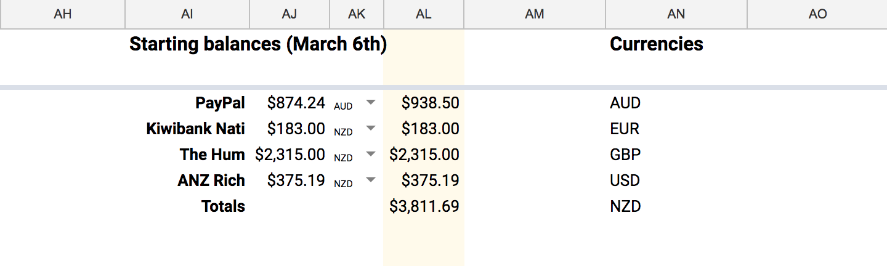
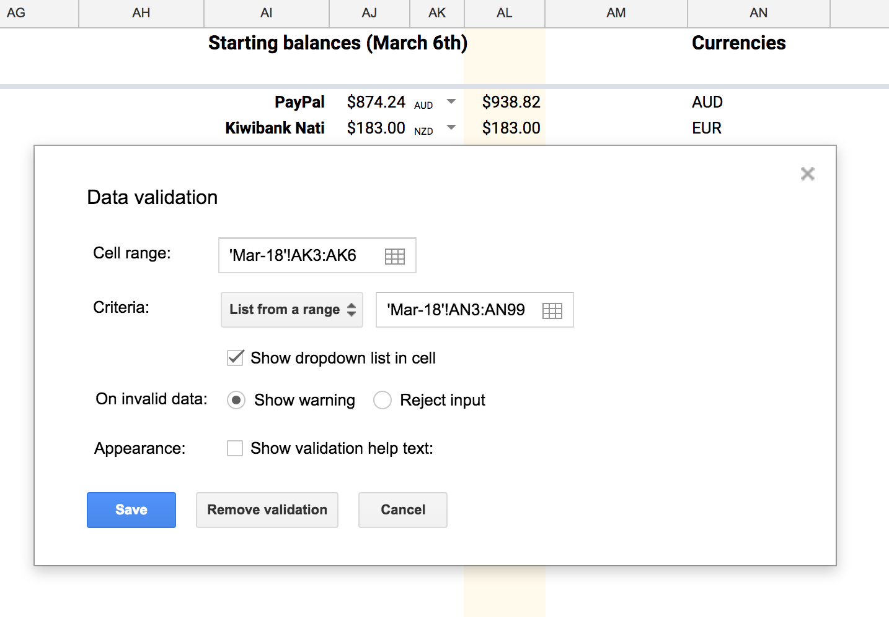
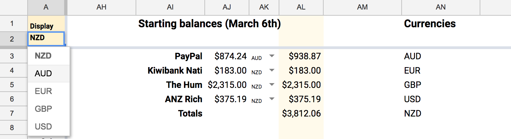
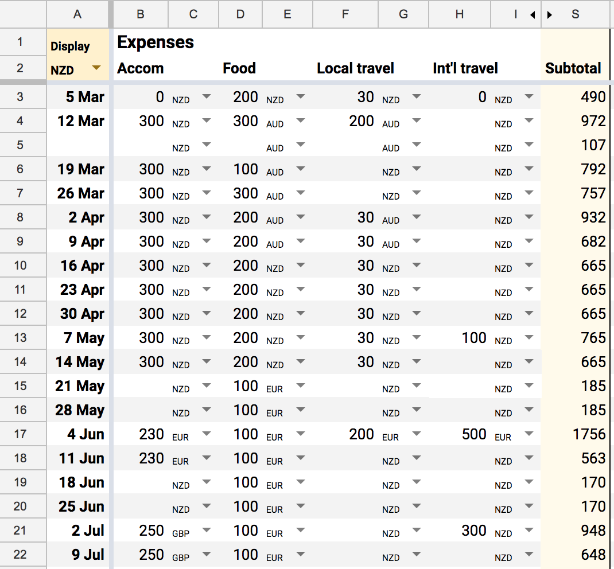
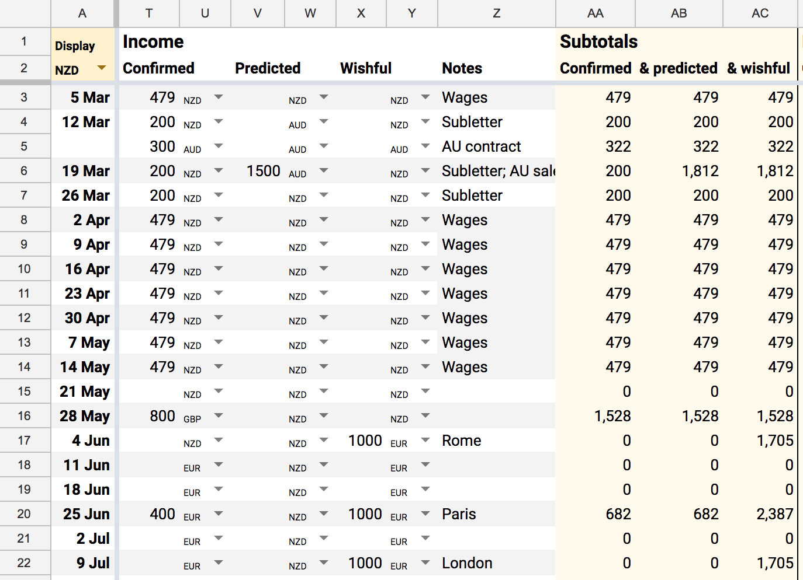
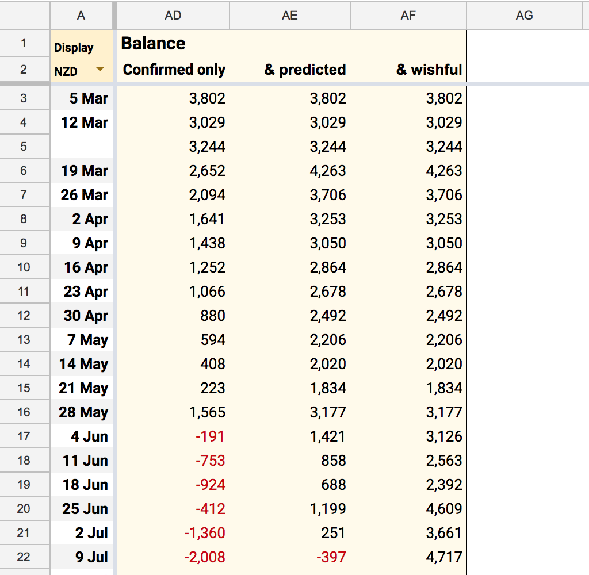

# Multi-currency Budgeting for Digital Nomads
## A clever use of Google Sheets to track income and expenses in all the currencies $ ¥￡€

Last year [my work](https://www.thehum.org/) with my partner Nati took us to 13 countries. It is an amazing privilege to earn a living on the road, travelling and working with my lover in lots of lovely locations… but the money side can be a constant source of anxiety and strain on our relationship. 

As we prepare for another big trip this year, I decided to put more energy into budgeting. *(By the way, you can [join our newsletter](http://eepurl.com/de1yEn) to stay informed about our travels.)*

Without a budget, I have to carry very approximate numbers in my head (*they’re going to pay us $1000, and that other job is likely to be €1500…*). These numbers get more approximate as they include more currencies (*dollars are basically euros right?*). When I’m in a good mood, my approximations tend to be rosy. But if I wake up with low energy, then my mental math gets more pessimistic, plunging me into anxiety (*we’re going to get stuck in Greece*) and depression (*I’m broke because I’m worthless*). When I’m in *it’s all going to be fine* mode, and Nati is in *how the heck are we going to get home* mode, that’s a sure recipe for tension and frustration in our relationship. 

It seems pretty dumb to spend energy arguing about crappy math; I would rather focus my relationship energy on things like intimacy, fun, and mutual care. So this week I made the spreadsheet of my dreams to take the guesswork out of it. Here’s how it works:

## 1. Starting balances
When I sit down to write the budget, the first step is to bring in the actual balances across our accounts.

## 2. Recorded currency
Notice that Paypal is in AUD, where the other balances are in NZD. Next to each total is a dropdown where I can select between the currencies I care about. You create these dropdowns in Google Sheets by highlight the cells where you want them to appear, then select *Data validation…* from the *Data* menu.

In the *Criteria* section I’ve selected *List from a range*, and then selected a long list of cells in column AN. This means I can keep adding new currencies to the list and the dropdowns will be all updated immediately.

## 3. Displayed currency
In the top left of the sheet I’ve added another currency dropdown — when I change this, all the yellow cells in this sheet get converted into the selected currency. Currently I’m in New Zealand so I’m displaying in NZD. Next week we’ll be in Australia though, so I can switch over to AUD and my balances will be converted instantly.

Here’s the formula that is doing the currency conversion:

= AJ3 * 
  if( A2 = AK3,
     1,
     GoogleFinance("CURRENCY:" & AK3 & A2, "average") )

I’ll switch out the cell references for descriptive names for each variable:

= Amount * 
if( DisplayCurrency = RecordedCurrency,
     1,
     GoogleFinance("CURRENCY:" & RecordedCurrency & DisplayCurrency, "average") ) 

In English: if the *Display currency* for the sheet is the same as the *Recorded currency* for this cell, then multiply the *Amount* by 1. In other words: if you entered a balance in NZD and you’re viewing it in NZD, don’t do a conversion.

Otherwise, if the currencies are different, multiple the recorded amount by the currency exchange rate, which you can access with the GoogleFinance function, like `GoogleFinance("CURRENCY:NZDAUD", "average")`

## 4. Account for predicted expenses
The rest of the sheet is a pretty standard budget, with the addition of hundreds of these little currency dropdowns:

There’s a row for every week. I add in likely expenses divided into categories (*in this screenshot I’ve hidden some of the columns to save space*). For each entry, I use the dropdown to select which currency it is recorded in. Then when I want to add things up, I repeat the conversion formula. So for instance the subtotal in *S3* is calculated like this:

= (B3 * if(A$2=C3, 1, GoogleFinance("CURRENCY:" & C3 & A$2, "average")))
+ (D3 * if(A$2=E3, 1, GoogleFinance("CURRENCY:" & E3 & A$2, "average")))
+ (F3 *  if(A$2=G3, 1, GoogleFinance("CURRENCY:" & G3 & A$2, "average")))
+ (H3 *  if(A$2=I3, 1, GoogleFinance("CURRENCY:" & I3 & A$2, "average")))

## 5. Account for different income scenarios

Then over on the income side, I record entries in one of three categories:

*Confirmed* means we have a contract, we can count on this money being paid to us. To be extra conservative, I assume everyone pays us late, so I enter all the big payments with a month’s delay.

In the *Predicted* column is income that is pretty likely, but not certain. E.g. when we’re selling tickets to our workshops, I can *predict* that we’ll get AUD$1500, but it wouldn’t be wise to count on it.

The *Wishful* column reminds me that everything here is “wishful thinking”. I’m wishing my future self will get organised and book some gigs in June so I can have a nice holiday in August.

## 6. Track balances in different scenarios

Finally I can calculate our predicted bank balance week by week:

Having the 3 columns takes all the guesswork and approximation. From this budget I can see we’re definitely fine until June, and we might make it to July if our predicted income arrives. Then I can go through and add more entries to the *Wishful* column, e.g. if we want our *Confirmed* balance to never dip below $1000, I can see I need to book some more work in April.

## 7. Rinse and repeat

In a month or so, I’ll sit down and repeat the process. I’ll duplicate the sheet, update the balances, then go through and update all the upcoming weeks with better predictions. After a few months I should be able to calculate a reasonable margin of error (*just how rosy are my guesses anyway?*).

That’s it! I’m feeling less anxious already. 

I’ve made [an example sheet](https://docs.google.com/spreadsheets/d/1K0NYSsNZeJVRhvp2NBA8opKjklpyI93U41iklslZNrU/edit?usp=sharing) which you can copy. I’m happy to answer any questions if this is unclear. I’d love to hear if this technique helps, or if any of you travellers have another solution to share.

*p.s. Speaking of money! If you want to encourage me to keep writing you can [give me money on Patreon](http://patreon.com/richdecibels).*

