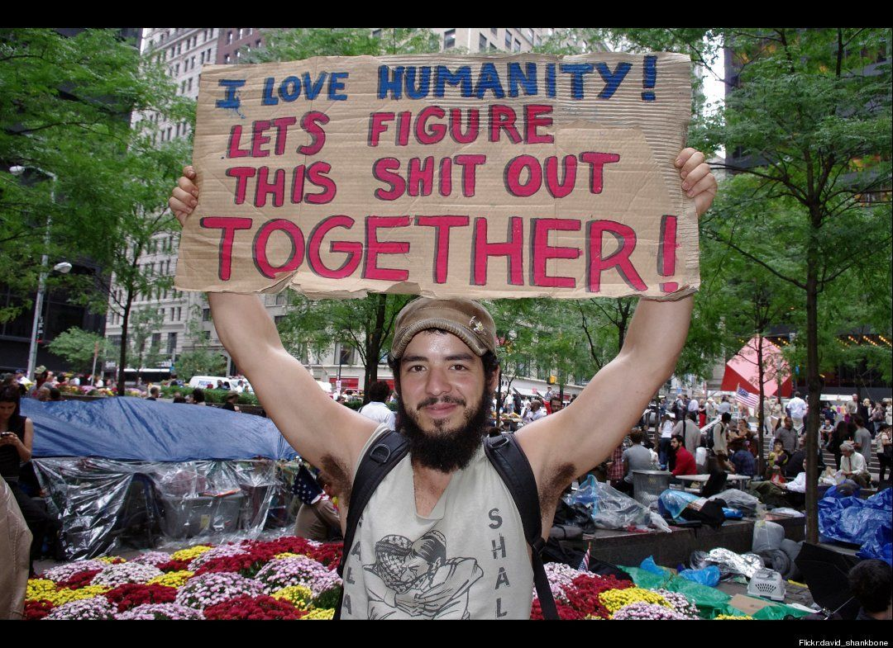
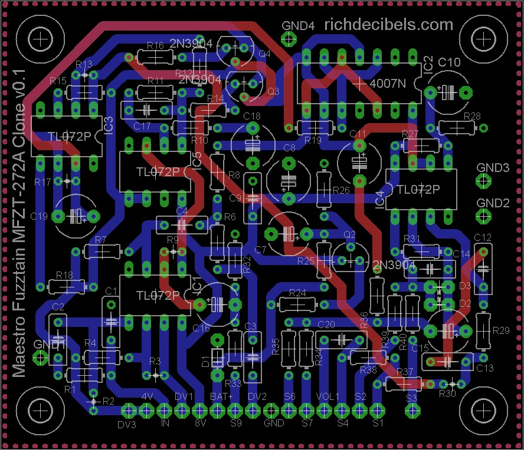
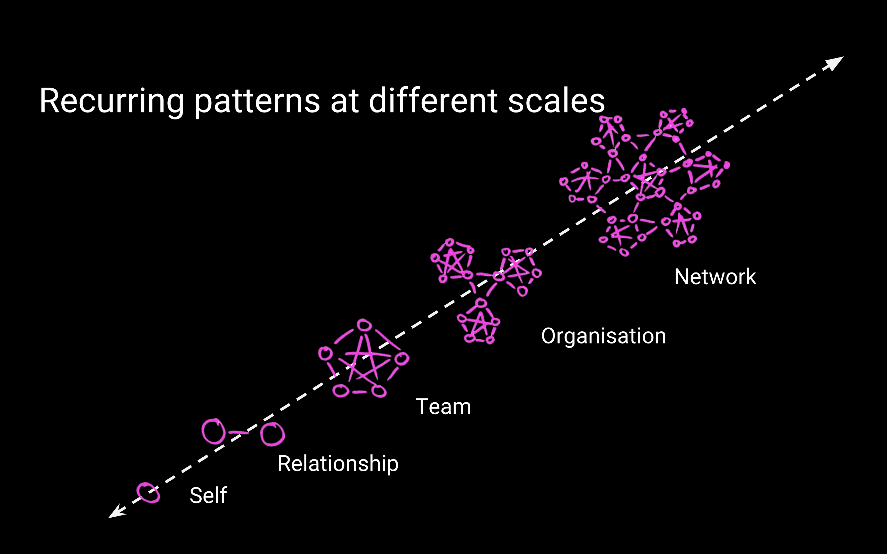

# Towards a Politics of Listening
## Reporting from “The Direct Parliament” conference in Florence

If you’ve read any of my writing, you will have guessed I have some opinions about how we could do large scale governance differently. But the tool we’re building is designed only for small scale: If you’ve ever used [Loomio](https://loomio.org), you’ll see that it’s designed for groups of up to a few hundred people, max. There’s a big gap between the decision-making context of a grocery co-op and an entire country.

So I was really pleased to be invited to make a presentation at [The Direct Parliament](https://scalingdemocracy.net/2018/05/09/the-direct-parliament-conference-schedule/#more-684) conference in Florence last week, where I could connect the dots between the large scale and the small. 

The conference was coordinated by Marco Deseriis, who studies networked society with a cultural/political examination of Internet-based activism. The Direct Parliament came at the conclusion of his 2-year research project [Scalable Democracy](https://scalingdemocracy.net/about/). I was first introduced to Marco when [he interviewed me back in 2016](https://www.opendemocracy.net/digitaliberties/marco-deseriis-richard-bartlett/loomio-and-problem-of-deliberation), looking especially at the mass adoption of Loomio in the early phase of Spain’s Podemos movement-slash-party. I have really appreciated following along with his research blog, which is full of excellent interviews like [this one with Miguel Arana Catania](https://scalingdemocracy.net/2018/01/14/limits-to-the-scalability-of-online-participation-in-podemos-an-interview-with-miguel-arana-part-1/) from the Participation Team of Podemos, revealing the tensions between the social movement’s manifestations in the streets and in the institutions.

The day-long conference was all live-streamed, so you can [watch videos of the presentations and discussions here](https://www.youtube.com/watch?v=GOI5gWBtKTM). My talk starts 13 minutes in, there’s [a direct link here](https://youtu.be/GOI5gWBtKTM?t=782). If you prefer reading to watching, I’ve included an approximate transcript below.

I usually avoid speculation about the large scale because I often see it distracting us from more immediate local concerns, where we can actually have tangible impact. But people keep asking me what I think we should do about governments, so I’m starting to develop some thoughts on the topic. I’d love to hear what you think.  Feedback welcome :)

# Transcript: Everyday Governance with Loomio

Thanks for the invitation to join this conference. I’m grateful to be here, and looking forward to learning with you all. I come from New Zealand, so sorry about my poor English. I co-founded a technology company called Loomio. I think technology is quite boring though so I won’t talk too much about it. 

> software is an artefact of values and beliefs
 
I think software is an artefact, a by-product of our values and beliefs. So I don’t want to spend much time telling you about  the software we built; I think it will be more interesting to share some of my values and beliefs, rather than telling you all about our software platform. Bear in mind I’m one of many co-creators of Loomio, so my subjectivity is only a limited slice of the pie.

First I want to share some of my personal experience so you know where I’m coming from. 

In 2011, I joined the Occupy Movement. I had no experience with activism or social movements before then. I had just been watching Occupy Wall Street online and I thought it was interesting. I saw all these people saying that society is in crisis, that we face enormous environmental and economic challenges, and that our institutions are not capable of coming up with good solutions. In retrospect, I think Occupy was an opportunity to get firsthand experience of the challenges of democracy, and to start prototyping alternative institutions. 

When the Occupy Movement made it all the way to Aotearoa New Zealand, I went down to our Civic Square in Wellington to observe: who are these people, what are they going to do? Very quickly, I changed roles, from observer to participant. I  found there was no way to stand outside, I had to be involved.  

For the first time in my life, I met with citizens in the city square. We talked together about our hopes and fears, sharing, learning, debating, connecting. It was tremendously inspiring, and shocking, like, *why have I never met other citizens like this before?*

On the first day, somebody decided he was going to stay the night in the square. Two weeks later there were 100 tents, a whole village had appeared. 

The amazing thing about this village was that nobody was in charge. We made decisions together: everyone needs to eat, so how are we going to organise food? We made a kind of free university, so what kind of education programs shall we run? All these people want to stay in the square: how can we make shelter for everyone? TV cameras keep visiting us, what should we tell them? Nobody was the boss, we had to negotiate and improvise.

Now nothing in my education had prepared me for this. I’m trained as an engineer. As an engineer I was taught an approach to problem-solving that was all about **being right**. I did research, I made simulations, I built electronic circuits and tested them with careful measurements. I was trained to be objective, detached, outside of the system, an expert observer with a brilliant intelligence. 

In the assembly at Occupy, I discovered these skills are not very useful in deliberating with others. **In the assembly I learned that my empathy is much more useful than my intelligence. **

Negotiating with other people, trying to find agreement about how we should organise our little village, I learned the most important thing I could do was **to listen**. Not just listening to rebut — listening to understand, *where are you coming from? what do you believe? what do you value? why do you think like that?*

When I truly understand somebody’s position, then I can make a proposal that they can agree with. It’s not about being very clever, having the best ideas, or the best ethics, it’s just about listening, being flexible, and looking for solutions that satisfy as many people as possible.

So, there we are in the city square sitting in circles and making consensus decisions, it’s very picturesque and inspirational. 

It was also kind of a disaster, right? In my opinion, the Occupy camps all over the world ended for basically two reasons. 

Some camps were destroyed by the state. Violent, brutal, armed thugs paid by the government to vandalise and dismantle these flourishing communities. The other camps collapsed under the weight of consensus. We learned how difficult it is to govern a public space, especially when you’re making decisions with random people, some of whom are drunk, or they are just passing through and sharing an opinion without any commitment to the community. 

Actually maybe these two reasons demonstrate the same thing: governance is very difficult. The state does stupid things like pepper spraying students at a peaceful protest. And we activists do stupid things like spending 6 hours in a consensus meeting that brings us no closer to our aims.

So, as our camp disintegrated, my friends and I were left with an enormous question: what next!? It felt like we had come so close to a dramatic evolution of how we govern society, and then it collapsed. So what do you do after the revolution fails?

Being the kind of people we are, we decided to make some software about it. We thought we could help activists organise more efficiently with software to support inclusive decision-making. 

So Loomio is a discussion forum like many others online, but the unique piece is the facilitation tools which are designed for productive and efficient deliberation. It’s not an endless conversation, the process is guided towards an outcome. E.g. you can poll people so see which options they like, then test for agreement with a proposal.

When we started we were just thinking of activists. But immediately we were swamped with interest from all parts of society, in many different countries. Now we have tens of thousands of groups using Loomio. In Wellington, the city government used Loomio to involve citizens, experts, and officials in policy making. Co-ops use Loomio for governance: approving new members, approving funding applications, debating about constitutional bylaws. 

My favourite example right now is [social.coop](http://social.coop): it’s a social network very similar to Twitter. But instead of selling advertising, the platform is funded by users paying a small subscription fee. In return, users are invited to participate in governance, [in a Loomio group](http://loomio.org/socialcoop): *what kind of censorship should we have on the platform? where should we host the data? what code of conduct should users adhere to?* It’s wonderful to see a digital platform being governed like a public utility.

Loomio is very simple software: you have discussions, suggest proposals, and people can say what they think about the idea. There’s no magical automation, machine learning, artificial intelligence, or decision-making robots, it is a very human process. I think it contributes at least two very useful innovations to the problem of deliberation, which can be generalised to other tools and processes.

## 1. asynchronous deliberation

First, Loomio breaks the tyranny of time. Usually, when you want to include people in a decision-making process, you do it in a meeting. These days we have video-conferencing so our meetings can extend into multiple spaces, but still, we need everyone paying attention at the same time. This is a fundamental constraint of deliberation: you need to organise a meeting, get everyone to pay attention simultaneously, and there’s a pressure to make all your decisions before the meeting ends. 

With Loomio you can involve people in decisions, without coordinating a meeting. People participate in their own time. 

I’m travelling through Europe with my partner. Back home, we’re negotiating about a new investment round for Loomio, and potentially restructuring the cooperative. We’re on the road, in a different timezone from the rest of the team, but we can participate in these very important decisions in our own time. We call it asynchronous decision-making, I think it is a very profound breakthrough, even though it is quite mundane!

## 2. visualise positions

The second innovation: visualising people’s positions. It’s very common for deliberation to get stuck in a very frustrated state. Essentially, everyone is simply arguing for their preferred option. *I think we should do this. Well I think we should do that. No we should do this.* Often what is happening here is that people are advocating for their preferred option, simply because their preference hasn’t been acknowledged. I get louder and louder describing the benefits of my proposal, because nobody has demonstrated that they understand my idea. So it really accelerates the deliberation process when you can visualise everybody’s position. First, everybody needs to be heard. Then they are much more willing to negotiate and make concessions. 

So with a Loomio decision, somebody makes a proposal, and then you can visually see where everyone stands. People agree or disagree, and they share a short summary explaining *why* they feel that way. so you can quickly focus in on the concerns, and evolve the proposal to respond to them.

Again, it is quite simple, but also a profound breakthrough. We use the same technique in [face-to-face workshops](http://thehum.org/events) and meetings to deal with difficult decisions. In this case, the graphic is used to visually distinguish preference (*I love it*) from tolerance (*I can live with it*):

---- 

I want to share a bit more about my beliefs, some of the thinking behind the software.

This shows you how I understand social change. The chart keeps going up to the right, with bigger and bigger scales: cities, states, the planet, all of life, etc. Many of us are motivated by large-scale change, I expect that’s why we’re at this conference: we want to rebuild the economy for equality, or reimagine politics, or repair the division between humans and the rest of nature. Big big change. But social change is very complex, and non-deterministic, it’s not a straightforward system. I don’t know how we re-wire society, but this picture shows my intuition. I believe we need to consider many different scales at once.

For example: I want to change the system called patriarchy. It seems to me a very urgent challenge. But if I just focus on the large scale, trying to dismantle the system, I may miss a lot of insights that are down at the lower end, much closer to me and my immediate experience. Down here there are some questions just for me: *how do I support patriarchy, how do I benefit from it? or, how do I reproduce patriarchal dynamics in myself, how do I dominate myself?* and then one step up, looking to my relationships: *am I in equal partnership, or in domination relationships? *Then I can examine my teams: *are we treating each other with respect and equity, or does one person dominate the rest?* To me it is very important to have integrity and alignment at all scales. So yes, I will join a social movement against patriarchy, demanding a change in how we distribute power in society and how we run institutions. *And also* I need to work at the very small scale.

This is what is in my mind when I am using Loomio. I believe it is very important to practice deliberation at the small scale. Learn how to share power, to negotiate, to listen, to make concessions, to empathise, to let go of demands, to find creative solutions. Simply, I believe the practice of small scale democracy makes me a much more capable citizen.

I’m not sure about the large scale. I think we will have much better ideas once people have more opportunity to practice at the small scale. 

Right now, the best large scale example I know of the is in Taiwan. My example is 4 years old, but still most people don’t know about it, so I guess I will be the Asia-Pacific representative for this conference and [share the story again](https://civichall.org/civicist/vtaiwan-democracy-frontier/).

In 2014, the Sunflower Movement occupied government buildings in Taiwan. They stayed there for 23 days, demonstrating how to run a transparent deliberative democracy process to renegotiate a trade deal with China. After the movement, many independent politicians won seats in government, including the premier of Taiwan and the mayor of Taipei. That is, they are there to represent citizens directly, without the mediation of a political party. Since then, there have been many experiments in citizen participation in law making. 

The [vTaiwan project](https://vtaiwan.tw/) uses a tool called [pol.is](http://pol.is) to involve thousands of people in opinion gathering, which like Loomio, creates a visualisation of people’s position on an issue. Once the opinion groups are clear, then representatives of each group come together for an in-person deliberation. This is broadcast publicly for anyone to watch. Then, having understood the perspectives of the different stakeholder groups, citizens are invited to suggest statements that they believe everyone can agree with. In the end, the government agrees to implement every consensus point generated by the process, or to provide detailed rationale for why it is not feasible.

This is incredibly inspiring to me, and I hope more people in the Western world will pay attention to the developments in East Asia. And I will say, the technology is useful, but more important is the political strategy and the facilitation skill of the activists driving this change.

I’m not sure if the government of the future is going to use pol.is, or Loomio, or LiquidFeedback, or whatever technology. But I hope as more people have access to a kind of everyday democracy, we’ll be much more able to work together creatively, efficiently making great decisions that work for everyone.

So if the question of this conference is “how do we reclaim our vision of democracy?” I think the answer is very straightforward, and very difficult. How do you get better at anything? With practice. I propose we should practice democracy more-or-less everyday. In our schools, in our homes and workplaces. Learn what democracy is composed of, in our own intimate experience, and then we will be more equipped citizens, less naïve, less easy to manipulate by demagogues and propagandists. I imagine children and teachers collaborating to govern their schools. Workers coming together to self-manage their workplaces. Citizens working together with city officials and experts to develop good policy.

Most of all, I imagine what extraordinary breakthroughs we might discover if more of us learned to listen to the people on the opposite side of the political fence. What if we could hear the values and beliefs beneath their position, rather than just dismissing them as stupid or evil?

*p.s. this story is licensed with no rights reserved, available for reproduction [on my website](http://richdecibels.com/stories/politics-of-listening)*
*p.p.s. you can support me to keep writing with claps, shares, and [dollars](https://www.patreon.com/richdecibels)*
