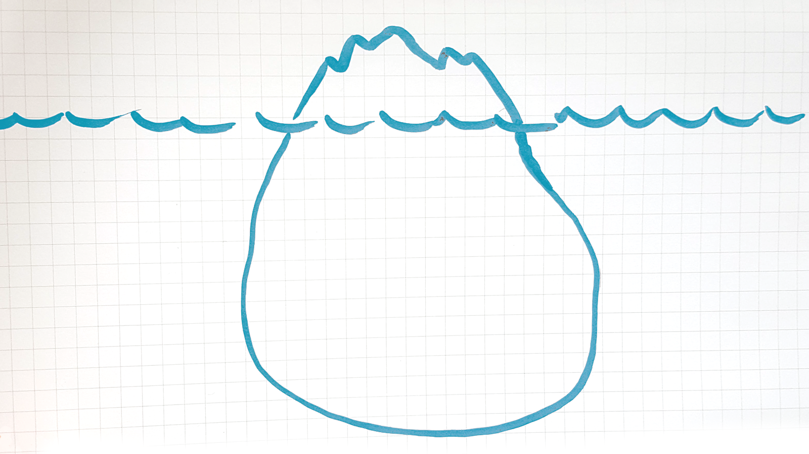
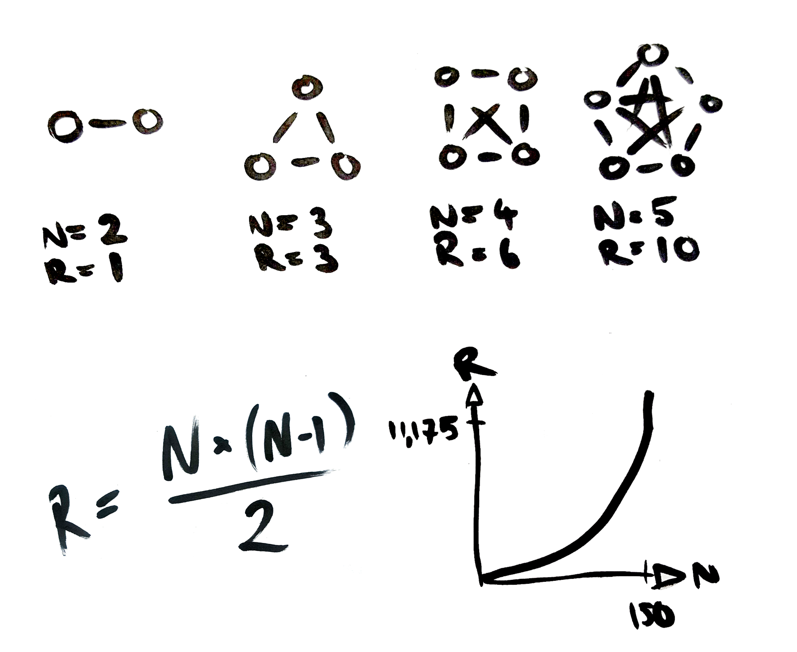
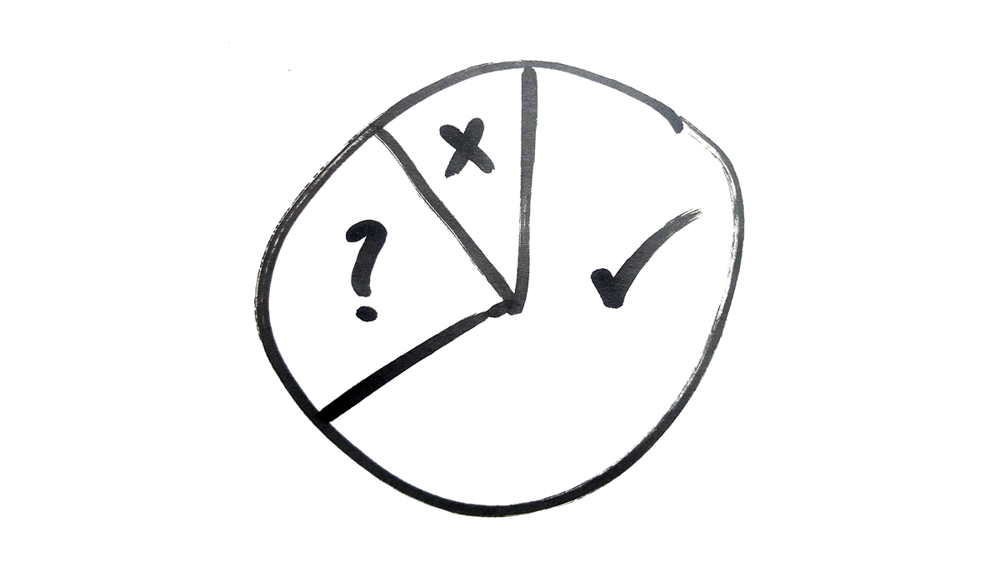
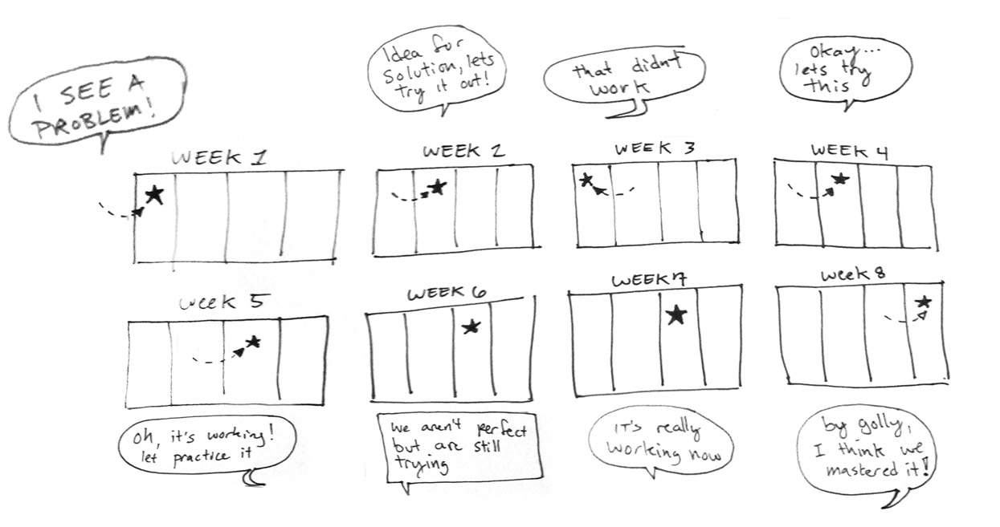
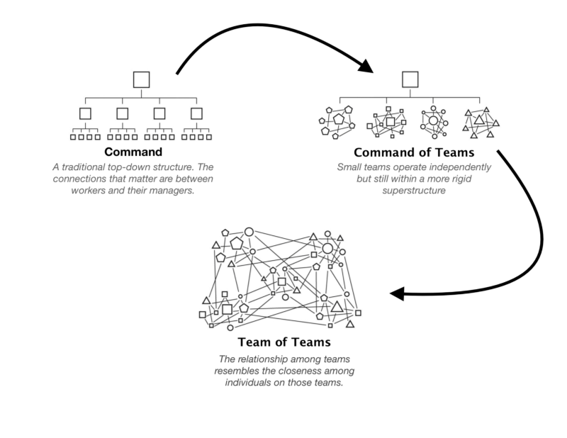

# The Vibes Theory of Organisational Design
## The bigger the group, the more rules they need. Can we do better than written agreements?

*In this article I’m going to bite off some big ideas, musing on the limitations of encoding agreements in text. To keep it grounded, I’ll illustrate the ideas with real-world stories. I’ll include a couple of practical tools you can try right away. But mostly, this is a reflection from the frontiers of decentralised organising: the ideas here probably only reflect the reality of a tiny number of organisations. It’s highly speculative, subjective, exploratory. I’m not educated in social psychology so I haven’t quoted any sources and I’ve probably mangled the science. In other words: don’t try this at home. The invitation is to put on your safety gear and come exploring with me…*

First I’ll set some context, exploring why groups create written rules as the grow. Then, I’ll name some of the dysfunctions that emerge from the rule-setting process. Then I speculate that we might get different outcomes if we used something other than a written rule book. Here goes!

## Where does togetherness come from?

Lately I’ve been reflecting deeply on this question: *what holds a group together?*

Small groups can maintain a lot of **togetherness** without much explicit structure. We can hold shared context *without needing to agree precisely on the words that describe that context.* 

When the group is small, everyone can build peer-to-peer trust bonds with everyone else. It is pretty easy to trust someone once you’ve shared food with them a couple of times, or done some engaging work together, or supported them through a hard day. With a small number of members, it doesn’t take long for everyone to have a coffee date with everyone else. If you have a team of 5, it only takes 10 coffee dates for everyone to get some time together.

Arriving into this high-trust environment, newcomers can accelerate their own trust-building process. If I’m the 6th person to join, and I spend some time with three of the original members and decide I like them, then I can skip ahead to trusting the other two without having much direct interaction with them, because *any friend of yours is a friend of mine!*

You can have all of this lovely trust and belonging and harmony *without having to talk about it*. Bonding operates down at the level of your emotions and psychology: we stay together because it *feels good to be together*. We have a sense of each person’s unique skills and interests. We like each other. We have a shared sense of direction. Notice none of that needs to be written down.

When there’s some tension between people, it’s easy to spot. If the team is made up of emotionally responsive adults, somebody will notice that Tina and Sam are not talking to each other, and will support them to repair the relationship. Everyone can see everyone else. Everyone can know everyone else. **Everyone can fit around a dinner table** and have a conversation. So you don’t need to formalise a lot of processes or make explicit agreements.

But this lovely easy harmony is impossible to maintain with many more people. Once your group grows bigger than a dinner table, you need to introduce some scaffolding to maintain the **togetherness**. If you have a team of 5, everyone could have a 1-on-1 conversation with each other member, and it would only take 10 meetings for everyone to see everyone. You can do this over a weekend retreat or a roadtrip. For 30 people that leaps to 429 meetings. 150 people: 11,175 coffee dates. This unavoidable algebra makes big groups much more challenging than small groups.

## Bigger groups require more structure to keep them together

At a certain size we start making explicit structures to keep the group together, because it’s cognitively impossible for everyone to maintain a lot of context about everyone else.

Usually, this “explicit structure” comes in the form of written agreements, contracts, policies, rules, roles, guidelines, and best practices. In this article I’m going to take a closer look at this legislative approach to creating structure, and ask if “writing things down” is the best we can do.

If you review the [Enspiral Handbook](http://handbook.enspiral.com), or the [Gini Handbook](http://handbook.gini.net) or the handbook for any of these hip “future of work” organisations, you’ll see a bunch of roles and rules. These written agreements are the artefacts of deliberations. The deliberations follow a general pattern, something like: 

1. something harmful or frustrating happens
2. people in the group talk about it
3. they grow a shared understanding of the problem
4. people suggest different possible responses
5. we evaluate the possibilities, collectively running a complex simulation (*if we agree to this, what might happen next?*)
6. then finally, we decide on a response

When we talk through a problem, sometimes the response requires no action, like “that restaurant was crap, let’s not go there again”. Most of the time though, **the response is a new piece of structure**: you agree to a set of Restaurant Selection Criteria (rules), or appoint the Restaurant Selection Working Group (roles). I’ll jump to a real example to give you the flavour:

---- 

## *Story 1: Don’t feed the trolls*

*Right now I’m involved in a deliberation about a software project called [Scuttlebutt](http://scuttlebutt.nz). The founder Dominic Tarr was gifted $200,000 (thanks [Dfinity](https://www.dfinity.org)!) to work on this ambitious community-driven project. Dominic decided to break up that big dose of money and distribute it in a series of $5k grants, available to anyone who wants to help grow the ecosystem. Grant-making decisions are made with community input, up to 4 grants per month.*

*A few months in, after allocating 10 or 15 grants, one of the community members suggests a “pause and review” to check how well the process is working. There’s a big discussion, lots of people taking lots of time to write out their thoughts and consider the ideas of others.*

*Here’s my summary of the conversation so far: essentially everyone is saying “this is the best grants process I’ve ever participated in”, with a bit of “we could improve this or that detail”. Everyone that is, apart from one person, who alternates between trolling, insulting people, making incoherent arguments, demanding attention, and not listening.*

*So now we’re at a crucial point in the development of the community. Can we collectively agree that “don’t be a dick” is a good enough principle to keep the grant-making process running smoothly? Or do we need to make an explicit written agreement about what behaviour is appropriate? — [Join me on Scuttlebutt if you want to see how this plays out!](https://medium.com/swlh/im-sick-of-facebook-8e7c7fa03b0a)*

---- 

## Problem \> Deliberation \> Agreement

This is a common pattern right? There’s a problem, we talk about it, and then we decide to add a bit of structure to prevent the problem from recurring. You deliberate together, aiming to get to a new agreement: *we expect to handle that problem in future with this new rule.* 

These conversations are a good way to get to know each other, and discover what the community values. Deliberation takes up hours of time that could have been spent on more obviously productive activities. Sometimes that is a good investment in bonding, but it can get a bit tiring if you over-do it. 

I’m interested in what happens when you run the problem-deliberation-agreement loop over a number of years. I’ve been experimenting with self-governing groups since 2011 so I have a bit of firsthand experience to reflect on. I’ve noticed a few side-effects of this loop. I’ll name three of them: attention drift, constitutional accretion, and delusional mythology.

### A. Attention drift

If you govern your network/community/organisation with a lot of deliberation, eventually some people tune out and learn, hey, nothing falls to pieces when I withhold my opinion — I’ll stay out of it and just focus on my little corner. You’ll see some of your most experienced people stepping out of the way. 

So the decision-making population narrows down to a) the people with the biggest investment (e.g. your personal identity is closely tied to the collective identity) and b) the people who most enjoy sharing their opinions on governance questions. That’s not a *bad* way to make decisions, exactly, but it leaves a lot of collective intelligence un-engaged. It also leads to a gradual decrease in legitimacy of these decreasingly shared decisions, opening room for a fork or a decay of the “togetherness”.

### B. Constitutional accretion
If you keep running the problem-deliberation-agreement routine, you’ll start to experience constitutional accretion: over time, these agreements start to build up.

I’ll illustrate the accretion process with another story. This one comes from Enspiral, which is a network of 100-300 people forming social-impact companies. It’s a group with strong boundaries and a lot of engagement in governance.

---- 

## *Story 2: Digging Through the Sedimentary Layers of Enspiral’s Agreements*

When I joined Enspiral in 2012, we had [3 agreements](https://github.com/enspiral/agreements/tree/master/agreements-old) (People, Ventures, Decisions). Later on we added the Diversity Agreement to signify our intention to grow the demographic diversity of our membership. In 2016 there was [a major renovation of the network](https://medium.com/enspiral-tales/breathe-in-leadership-breathe-out-leadership-enspirals-organisational-refactor-884d0babf6b7) which brought us up to 8 agreements. Within a year, that number has grown to our present [set of 11 agreements](https://handbook.enspiral.com/agreements.html). 

These agreements are expensive to produce. Each of those is the result of a long deliberation, involving anywhere between 100 and 300 people. They are designed to symbolise our most important shared values and commitments. A new agreement is A Big Deal™, signifying some new shared understanding.

This is highly subjective, but I’ll sort them into three categories:

1. First are what I call “structural agreements”. We have six of them that to me are crucial to the day-to-day operation of the organisation (Board, Brand, Decisions, Financial, People, Ventures). 
2. The next category I call “boundary agreements”. They set expectations for what behaviour is appropriate and what can be excluded. I count three of them (Diversity, Harassment & Abuse, Personal Conduct). I’ve seen other communities get by with just one boundary agreement: “don’t be a dick”. The extra detail at Enspiral is probably a result of spending a lot of time together and doing high-stakes collaboration.
3. The third category I call “Nice idea, but”. We currently have two of them (Catalyst and Stewardship). They were the best solution we could design at the time, but we’ve never had the resources to implement them well.

So of our 11 agreements:

* **6 Structural Agreements** govern the day to day interactions of people and companies in the network. 
* **3 Boundary Agreements** don’t make any difference to my day-to-day interactions (note I’m speaking as a high-privilege, high-status community member). I hope they contribute to the safety and wellbeing of other folks, but personally they do nothing for me.
* **2 “Nice Idea, But” Agreements**: they exist on paper, officially carrying as much weight as the rest of them, but they just don’t match reality. 

Right now we’re in a pleasant limbo where people haven’t really noticed that the Stewardship Agreement and the Catalyst Agreement are not being implemented in the way they were intended. *(I’ve probably collapsed that liminal space by publishing this article, whoops.)* As far as I can tell, nobody is overly concerned just yet. But it would be nice if our theory matched our practice: it seems sub-optimal to have divergence between our explicit structure (what we say holds us together) and our implicit structure (what actually holds us together).

In a sense, if you can’t trust *one* of the agreements, you can’t really trust *any* of them. They’re either a set of highly significant guiding documents, **or they’re not**. How is a newcomer supposed to make sense of the discrepancy? We have agreements that are not up to date with our practices, and we have practices that are not up to date with our agreements. So what do we do?

### C. Delusional Mythology

Full disclosure: I believe that groups are mostly held together by good feelings, and the explicit structure is just an artificial scaffold. Enspiral’s written agreements are important because of what they symbolise, not necessarily because of the precise words they say. I think a group is held together by history and relationships and collaborative meaning-making and amorous feelings and psychological responses and co-imagined futures and shared identity, and yes some written agreements and explicit roles too, but I’m convinced the explicit stuff is just the tip of the iceberg. 

The explicit stuff is a lot easier to talk about, because we have shared language for it. So it’s easy for us to get distracted and focus on the agreements and lose sight of the underlying meaning that they signify. It’s easy to confuse *what we say* for *what we mean*. At times during the Enspiral journey, I’ve felt like we’ve given more attention to the abstract structure of our organisation and lost sight of the *tangible things that people are doing*. We mistake the symbols for what they symbolise. 

Okay I’m getting pretty far-out now, time for another story:

---- 

## Story 3: Hallucinating together

Let’s say the group is a tree, and we’re all little kids playing in the branches. *(Please use a little kid voice as you read this story.)* 

I’m climbing in this huge tree telling you *I’m Jack and this is a beanstalk 🌱 and we’re going up to see the giant*. You’re happy to play along with my fantasy, so long as you can count on me to play along when you say *this is a spaceship 🚀 and we’re astronauts and we’re going up to space to camp on the moon 🌛*. 

The kids know the tree is a tree, but it’s fun to tell stories instead. Well, it’s fun when we all get to take turns inventing the story, and nobody is confused between fantasy and reality. 

In organisations we make up some imaginary stories called “roles” and “rules” and suddenly everyone stops playing. We all have to agree on the One True Fantasy. Even though most of us know the group is held together with good vibes, it’s easier to explain *“well we have the People Agreement, and the Ventures Agreement and if you look here in the handbook you’ll see…”*

---- 

## No gods, no masters, no books?

We make a rule-book, elevate it onto a pedestal, and then put ever-increasing effort into keeping it relevant, accessible and engaging. Meanwhile, the bigger the group, the less this book can describe the lived experience of any of the members. 

The obvious solution is to try harder. Find more volunteer hours, or pay someone to put more energy into keeping the agreements up to date. But I’m never satisfied with “try harder”; I think sustainable solutions usually look more like “try different”.

Some of us have a sense that there are negative side effects from the problem \> deliberation \> agreement loop (I’ve named three of them, I’m sure there are more). So when I reflect on these dynamics, I can’t help but blame **the written form** itself. 

When I get together in community and deliberate about a problem, what’s important to me is that I feel heard, that I feel we are responding intelligently and compassionately, that what we’re working on is meaningful, that we are adaptable and efficient, that I’m a valued member of the community, that I’m seen, that I can count on the community to respond to my needs, that I can be proud to overlap my personal identity with our collective identity. A good deliberation can meet all those needs. The written agreement we produce at the conclusion of that deliberation **is a symbol**, a placeholder that represents my needs and feelings and experiences. The actual written words can’t capture a fraction of the meaning.

> “Forgive me for this introduction to computing, but I need to be clear: computers really do operate on *symbolic representations* of the world. They really *store* and *retrieve*. They really *process*. They really have physical *memories*. They really are guided in everything they do, without exception, by *algorithms*. Humans, on the other hand, do not – never did, never will.” — [Your Brain Does Not Process Information and It’s Not a Computer](https://aeon.co/essays/your-brain-does-not-process-information-and-it-is-not-a-computer), by Robert Epstein

## Can we do better than written agreements?
So this is my big inquiry at the moment: *assuming we need some explicit structures to hold our groups together, can we do better than written agreements?*

I don’t have a great answer yet — it’s taken me weeks just to articulate the question! While I’ve been exploring, I’ve picked up some interesting leads to follow:

### 1. Community Mastery Board

Drew Hornbein from [Agile Learning Centres](http://agilelearningcenters.org/) introduced me to the Community Mastery Board (CMB). Working with self-governing groups of young children, they use CMB as a tool for “creating sustainable culture within a community through iterative trial and error”. Documentation is sparse, but you can [start to learn about it in Drew’s blog here](http://drew.agilelearningcenters.org/the-new-group-kanban-board/), [another blog here](http://dru2.com/change-up-meeting/), and [this one-page PDF](https://drive.google.com/file/d/0BxX8hMn15JGNQUVHa2pkeWhvRWM/view). (Also my long distance crush Art Brock [wrote a teaser way back in 2014](http://artbrock.com/blog/conscious-culture-creation-and-community-mastery-board). *C’mon fam, write that sweet documentation!*)

> “For instance, in our current space everyone is expected to clean up any dishes they use. We didn’t come to this decision by having a meeting and coming up with rules, rather by way of becoming aware of a problem and trying out a number of solutions and sticking with the one that stuck.” [Drew Hornbein — Agile Learning Centres](http://drew.agilelearningcenters.org/the-new-group-kanban-board/)

Instead of the expensive “problem \> deliberation \> agreement” routine, the process is focussed on finding something safe to try, as quickly as possible. The process takes minutes, not hours. Rather than spending a lot of time designing the best possible guess and getting everyone to agree with it, with CMB you just focus on trying a solution and reviewing it quickly. What most interests me about CMB is that it seems to be less focussed on the rules, and more focussed on the “deltas”, i.e. what needs to be changed. I can imagine running a “change-up” meeting every week or every month and developing a shared sense of “this is our capacity for change.” 

Compared to a rule book on a pedestal, CMB feels much better suited for the way our brains work, and the way our groups are actually held together. Over time, the good rules get embedded into the group culture: if you see everyone else cleaning up their own dishes, you don’t need a sign to tell you you’re expected to clean up yours.

I don’t think this process is ready to be dropped in to large self-governing groups as a replacement for deliberation and legislation. But it’s inspiring to see an approach to governance optimised for ongoing change, rather than trying to capture an ideal steady state.

## 2. Guide Board

When I told him about the Community Mastery Board, new Enspiral contributor [Matti Schneider](http://mattischneider.fr/) introduced me to his Guide Board, which is [thoroughly documented here](http://mattischneider.fr/agile/guide-board.pdf) (*swoon!*).

> “A guide is therefore the reification of a debate conclusion, *a reminder that a discussion took place*. These keywords and drawings are here to recall the agreement to participants, as a tangible trace of the decision. […] it became clear that the illustrated guides were easier to memorise, and much easier to identify when glancing at the board. ”

Things I like:
* Guides are primarily graphical icons, not written words. (The dynamics of creating, agreeing, and updating graphics is very different to what we’re used to with text. I don’t know if it is better, but different is worth exploring.) 
* Closing a guide (i.e. erasing a rule) is part of normal business. (I’ve never participated in a community that could undo old rules without a huge amount of effort and drama.)
* The guide board (like CMB) is designed for flow: the passage of time is laid out intuitively from left to right. It’s more like a movie, less like a book. Each rule is contextualised in time: acknowledging it was relevant last year, without claiming that it will be eternally relevant.
* A guide reminds us that we talked about something, it doesn’t pretend to capture the content of the conversation.
* Both the Guide Board and Community Mastery Board are oriented towards **continuous participatory change**, less “what are the rules around here”, more “how much capacity do we have for changing the rules here”

# 3. Team of Teams

As I’ve been contemplating these questions, trying to put my finger on my discomfort with written agreements, I’ve noticed a new trend at Enspiral. In conversation with the longest-standing members, I’m noticing a new consensus emerge: I believe Enspiral is evolving into what General Stanley McChrystal calls “[a team of teams](https://medium.com/@beaugordon/key-takeaways-from-team-of-teams-by-general-stanley-mcchrystal-eac0b37520b9)”:

The invitation was “welcome to the community, jump in and contribute, find opportunities, get supported to do meaningful work” and I think it is maturing into “welcome to the community: find a dinner table you like, or start a new one”. The difference is subtle but represents a profound shift in expectations: the network does not provide support, you can only expect support once you’ve found your team.

I’m anticipating a future version of Enspiral which has the minimum set of agreements to govern the whole, and maximum autonomy, diversity, and subjectivity in the parts. If we all spend most of our time in one or two dinner-table sized groups, we can stay focussed on the squishy human-to-human kind of **togetherness**, and put much less effort into  the explicit, written scaffolding that holds the whole together.

I don’t want us to spend a few hundred hours to design the Tables Agreement! I think it would be much more effective to have a few of the elders telling stories like “I thought I found purpose and connection when I joined Enspiral, but that was nothing compared to the depth of support I experienced once I found my table.”

---- 

So I’m publishing this as an open question, and I’d love to hear your contributions. **Who do you know that is doing collaborative governance with something other than written agreements?** 

Writing this highlighted the gaps in my education: I have tonnes of practice but very little theory. I’m open to your reading suggestions. I get the feeling that I’m bumping up against the artefacts of colonial/ patriarchal/ judeo-christian/ anglo-saxon/ greco-roman epistemology, so I’m most interested in learning from thinkers outside of the academy. Specifically I know I need to learn more about governance in oral cultures — if you have experiences to share, I’d love to chat with you. I also wonder if anyone can share stories from, e.g. collaborative governance with children, or with people who don’t read — there could be some interesting leads to follow there too.

*Thanks to [Matti Schneider](https://medium.com/@MattiSG), [Hailey Cooperrider](https://medium.com/@imhaileycoop), [Billy Matheson](https://medium.com/@billy.matheson), [Theodore Taptiklis](https://medium.com/@taptiklis), and [Drew Hornbein](https://medium.com/@hornbein) for their thoughtful contributions to this piece.*

*p.s. If you want to encourage me to keep writing: please share/ like/ recommend/ tweet or otherwise validate me quantifiably* 😍 📈
*p.p.s You can [give me money on Patreon](http://patreon.com/richdecibels) if you want me to hurry up and finish my first book.*
*p.p.p.s. I waive copyright on all my writing: you may do anything you like with this text. You’ll find pdf, markdown, and html formats [on my website](http://richdecibels.com/stories/vibes-theory/).*
